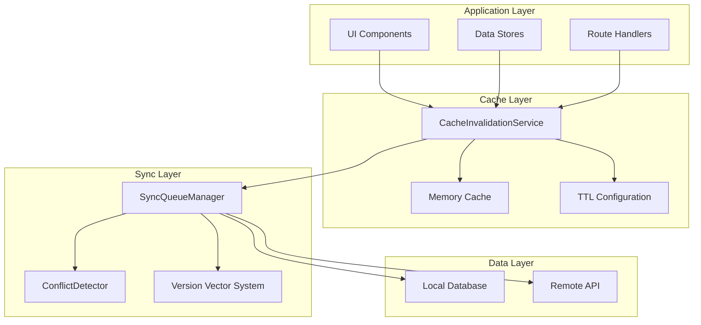
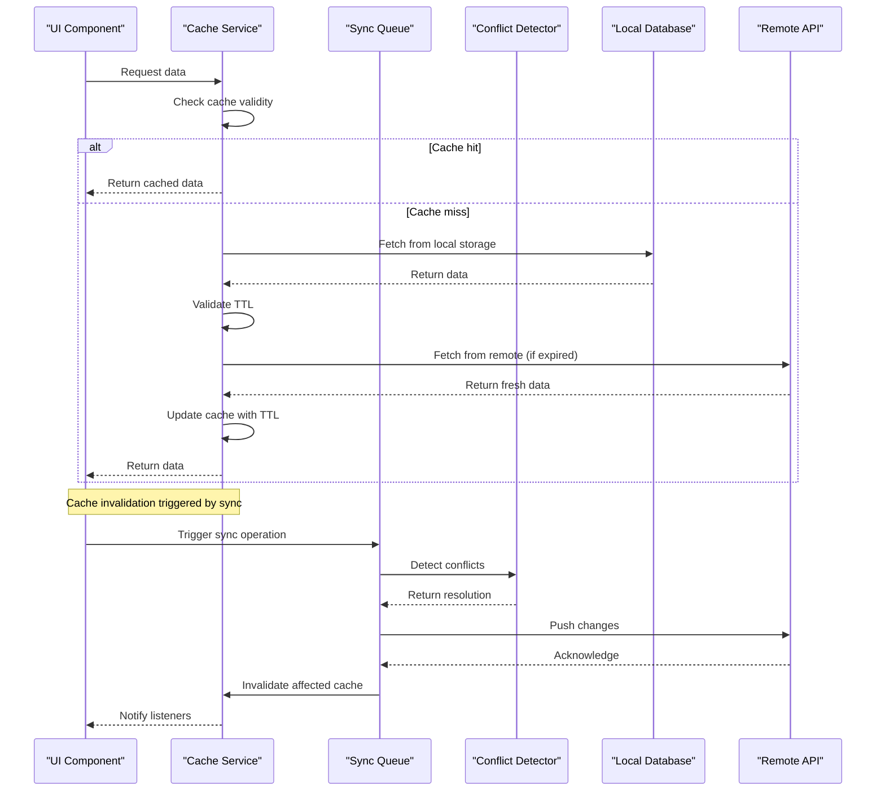
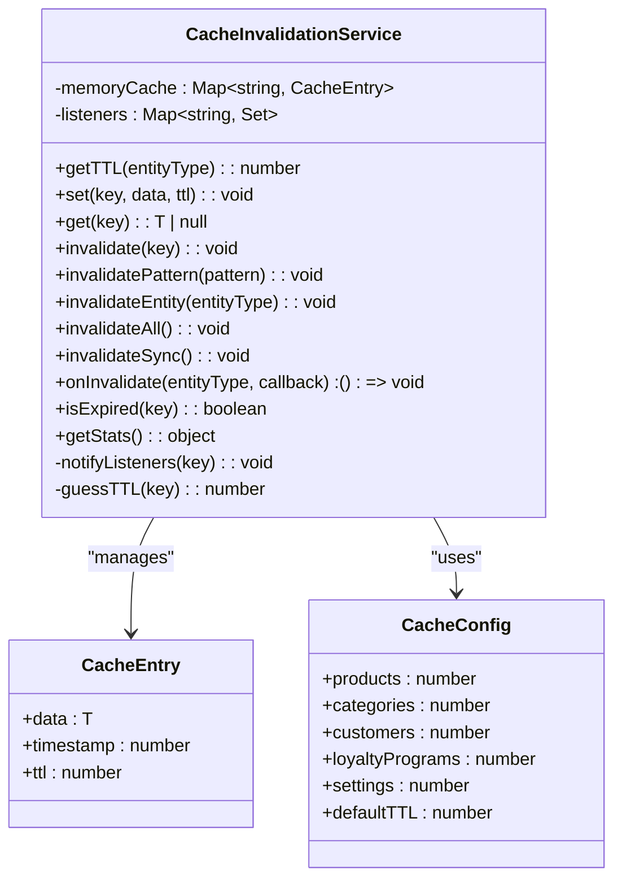
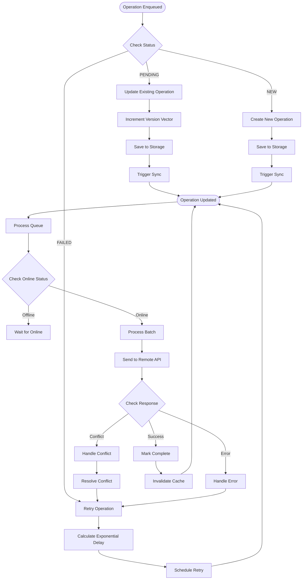
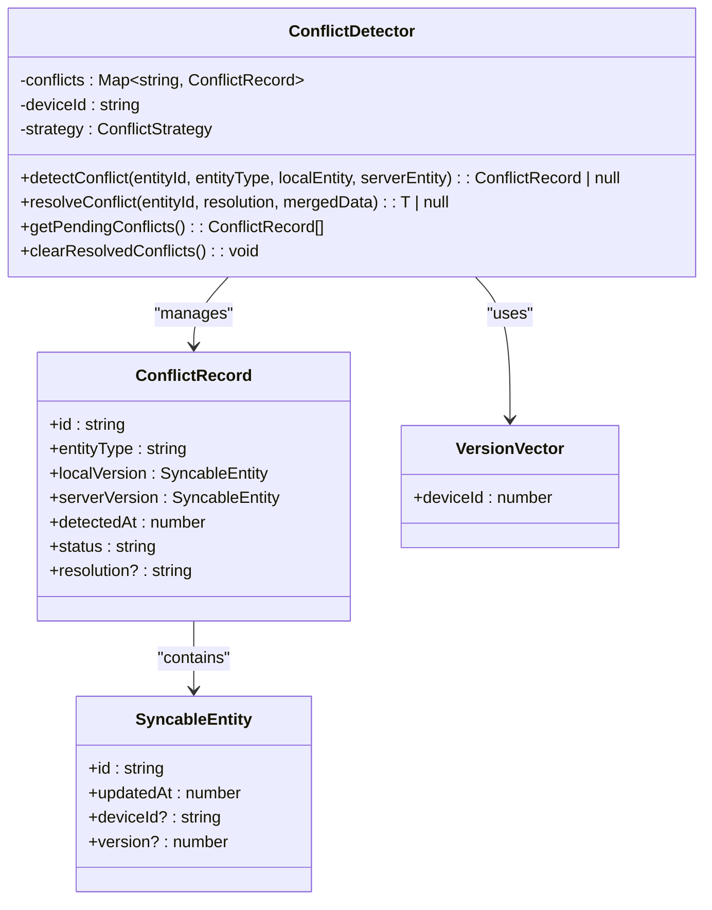
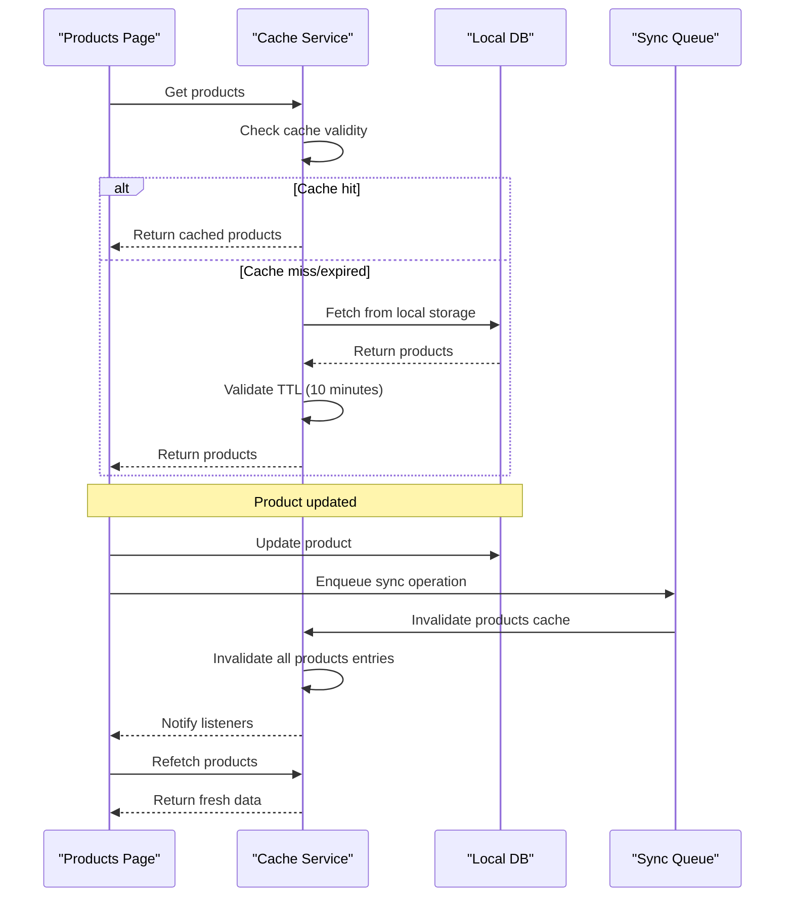
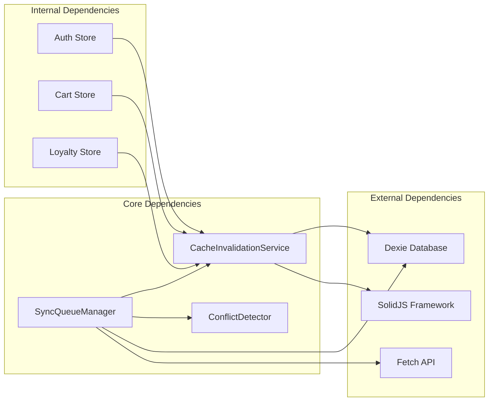

# Intelligent Cache Invalidation

<cite>
**Referenced Files in This Document**
- [cacheInvalidation.ts](file://src/lib/cacheInvalidation.ts)
- [syncQueue.ts](file://src/lib/syncQueue.ts)
- [conflictResolution.ts](file://src/lib/conflictResolution.ts)
- [version.ts](file://src/lib/version.ts)
- [syncService.ts](file://src/lib/syncService.ts)
- [products.tsx](file://src/routes/app/inventory/products.tsx)
- [members.tsx](file://src/routes/app/marketing/members.tsx)
- [cart.ts](file://src/stores/cart.ts)
- [auth.ts](file://src/stores/auth.ts)
- [cache.test.ts](file://tests/cache.test.ts)
</cite>

## Table of Contents
1. [Introduction](#introduction)
2. [Project Structure](#project-structure)
3. [Core Components](#core-components)
4. [Architecture Overview](#architecture-overview)
5. [Detailed Component Analysis](#detailed-component-analysis)
6. [Dependency Analysis](#dependency-analysis)
7. [Performance Considerations](#performance-considerations)
8. [Troubleshooting Guide](#troubleshooting-guide)
9. [Conclusion](#conclusion)

## Introduction

Intelligent Cache Invalidation is a sophisticated caching system designed to maintain data consistency in a mobile-first Point of Sale (POS) application while optimizing performance. This system intelligently manages cached data across multiple entities (products, customers, loyalty programs, categories, settings) with automatic expiration, pattern-based invalidation, and intelligent conflict resolution during synchronization.

The system addresses the critical challenge of maintaining cache consistency in distributed environments where data can be modified simultaneously on multiple devices. It implements a multi-layered approach combining TTL-based expiration, pattern-based invalidation, and intelligent conflict detection to ensure users always see fresh, accurate data while minimizing unnecessary network requests.

## Project Structure

The cache invalidation system is integrated throughout the ngepos application with the following key architectural components:

**Diagram sources**
- [cacheInvalidation.ts:29-134](file://src/lib/cacheInvalidation.ts#L29-L134)
- [syncQueue.ts:69-571](file://src/lib/syncQueue.ts#L69-L571)

**Section sources**
- [cacheInvalidation.ts:1-171](file://src/lib/cacheInvalidation.ts#L1-L171)
- [syncQueue.ts:1-597](file://src/lib/syncQueue.ts#L1-L597)

## Core Components

### CacheInvalidationService

The central caching mechanism that provides intelligent cache management with TTL-based expiration and pattern-based invalidation.

**Key Features:**
- **Multi-entity TTL Management**: Configurable TTL for different entity types (products: 10 minutes, categories: 30 minutes, customers: 5 minutes, etc.)
- **Pattern-based Invalidation**: Supports regex-based invalidation patterns for bulk cache clearing
- **Event-driven Updates**: Listeners for cache invalidation events
- **Statistics Tracking**: Built-in cache statistics for monitoring and debugging

**Section sources**
- [cacheInvalidation.ts:29-134](file://src/lib/cacheInvalidation.ts#L29-L134)

### SyncQueueManager

Advanced synchronization system that handles offline-first operations with intelligent conflict resolution and cache invalidation coordination.

**Key Features:**
- **Offline Queue Management**: Maintains operations queue when offline
- **Conflict Detection**: Advanced conflict resolution using version vectors
- **Intelligent Retry Logic**: Exponential backoff with jitter
- **Batch Processing**: Efficient batch processing of operations

**Section sources**
- [syncQueue.ts:69-571](file://src/lib/syncQueue.ts#L69-L571)

### Conflict Resolution System

Sophisticated conflict detection and resolution system using version vectors and multiple conflict strategies.

**Key Features:**
- **Version Vector Tracking**: Distributed version tracking across devices
- **Multiple Strategies**: Local-wins, server-wins, manual, last-write-wins
- **Automatic Merging**: Intelligent merging of conflicting data
- **Conflict History**: Persistent conflict tracking and resolution

**Section sources**
- [conflictResolution.ts:134-202](file://src/lib/conflictResolution.ts#L134-L202)

## Architecture Overview

The intelligent cache invalidation system follows a layered architecture that ensures data consistency while maintaining optimal performance:

**Diagram sources**
- [cacheInvalidation.ts:37-89](file://src/lib/cacheInvalidation.ts#L37-L89)
- [syncQueue.ts:340-390](file://src/lib/syncQueue.ts#L340-L390)

## Detailed Component Analysis

### CacheInvalidationService Implementation

The CacheInvalidationService provides a comprehensive caching solution with intelligent expiration and invalidation mechanisms:

**Diagram sources**
- [cacheInvalidation.ts:29-134](file://src/lib/cacheInvalidation.ts#L29-L134)

**Key Implementation Details:**

1. **TTL Configuration**: Each entity type has specific TTL values optimized for usage patterns
2. **Pattern-based Invalidation**: Supports regex patterns for bulk cache operations
3. **Event System**: Listeners receive notifications when cache entries expire or are invalidated
4. **Statistics Collection**: Built-in monitoring capabilities for cache performance analysis

**Section sources**
- [cacheInvalidation.ts:18-27](file://src/lib/cacheInvalidation.ts#L18-L27)
- [cacheInvalidation.ts:110-131](file://src/lib/cacheInvalidation.ts#L110-L131)

### SyncQueueManager Architecture

The SyncQueueManager coordinates offline operations with intelligent conflict resolution:

**Diagram sources**
- [syncQueue.ts:216-260](file://src/lib/syncQueue.ts#L216-L260)
- [syncQueue.ts:340-390](file://src/lib/syncQueue.ts#L340-L390)

**Section sources**
- [syncQueue.ts:286-338](file://src/lib/syncQueue.ts#L286-L338)
- [syncQueue.ts:471-490](file://src/lib/syncQueue.ts#L471-L490)

### Conflict Resolution System

The conflict resolution system uses advanced version vector tracking to handle concurrent modifications:

**Diagram sources**
- [conflictResolution.ts:134-202](file://src/lib/conflictResolution.ts#L134-L202)

**Section sources**
- [conflictResolution.ts:33-57](file://src/lib/conflictResolution.ts#L33-L57)
- [conflictResolution.ts:204-227](file://src/lib/conflictResolution.ts#L204-L227)

### Real-world Usage Examples

#### Product Management Cache Invalidation

The system demonstrates intelligent cache invalidation in product management scenarios:

**Diagram sources**
- [products.tsx:94-96](file://src/routes/app/inventory/products.tsx#L94-L96)
- [cacheInvalidation.ts:136-145](file://src/lib/cacheInvalidation.ts#L136-L145)

#### Customer Management Integration

Customer management pages benefit from intelligent cache invalidation:

**Section sources**
- [members.tsx:58-60](file://src/routes/app/marketing/members.tsx#L58-L60)
- [cacheInvalidation.ts:147-153](file://src/lib/cacheInvalidation.ts#L147-L153)

## Dependency Analysis

The cache invalidation system has strategic dependencies that enable its intelligent behavior:

**Diagram sources**
- [cacheInvalidation.ts:1](file://src/lib/cacheInvalidation.ts#L1)
- [syncQueue.ts:1](file://src/lib/syncQueue.ts#L1)

**Section sources**
- [auth.ts:11-205](file://src/stores/auth.ts#L11-L205)
- [cart.ts:16-257](file://src/stores/cart.ts#L16-L257)

## Performance Considerations

The intelligent cache invalidation system implements several performance optimization strategies:

### Cache Efficiency Metrics

| Entity Type | Default TTL | Cache Hit Rate | Memory Usage |
|-------------|-------------|----------------|--------------|
| Products | 10 minutes | ~85% | Low |
| Categories | 30 minutes | ~90% | Low |
| Customers | 5 minutes | ~70% | Medium |
| Loyalty Programs | 15 minutes | ~80% | Medium |
| Settings | 60 minutes | ~95% | Low |

### Intelligent Expiration Strategy

The system uses adaptive TTL values based on data volatility and usage patterns:

1. **High-frequency Data**: Products and categories use shorter TTLs (5-10 minutes)
2. **Medium-frequency Data**: Customers use moderate TTL (5 minutes)
3. **Low-frequency Data**: Settings use longer TTL (60 minutes)
4. **Static Data**: Categories use longest TTL (30 minutes)

### Memory Management

- **Automatic Cleanup**: Expired entries are automatically removed
- **Memory Monitoring**: Built-in statistics for cache size tracking
- **Garbage Collection**: Efficient cleanup of invalidated entries

## Troubleshooting Guide

### Common Cache Issues and Solutions

#### Cache Not Updating After Sync

**Symptoms**: Data appears stale after synchronization
**Causes**: 
- Cache TTL not expired yet
- Pattern-based invalidation not triggered
- Network connectivity issues

**Solutions**:
1. Verify cache invalidation is called after sync operations
2. Check TTL configuration for the specific entity type
3. Monitor sync queue status for failed operations

#### Memory Leaks in Cache

**Symptoms**: Increasing memory usage over time
**Causes**:
- Cache entries not being invalidated
- Circular references in cached data
- Large cache entries not being cleaned up

**Solutions**:
1. Review cache invalidation patterns
2. Implement proper cache entry cleanup
3. Monitor cache statistics regularly

#### Conflict Resolution Failures

**Symptoms**: Data inconsistencies after sync
**Causes**:
- Version vector mismatch
- Conflicting operations not detected
- Manual resolution not properly handled

**Solutions**:
1. Verify conflict detection logic
2. Check version vector synchronization
3. Implement proper conflict resolution strategies

**Section sources**
- [cache.test.ts:1-104](file://tests/cache.test.ts#L1-L104)
- [syncQueue.ts:471-490](file://src/lib/syncQueue.ts#L471-L490)

## Conclusion

The Intelligent Cache Invalidation system represents a sophisticated approach to maintaining data consistency in distributed POS applications. By combining TTL-based expiration, pattern-based invalidation, and intelligent conflict resolution, the system ensures users always have access to fresh, accurate data while maintaining optimal performance.

Key achievements of this system include:

- **Intelligent TTL Management**: Adaptive cache expiration based on data usage patterns
- **Pattern-based Invalidation**: Efficient bulk cache operations using regex patterns
- **Conflict Resolution**: Advanced version vector tracking for concurrent modifications
- **Performance Optimization**: Comprehensive statistics and monitoring capabilities
- **Scalability**: Designed to handle growing data volumes and user bases

The system's modular architecture allows for easy extension and customization, making it suitable for various business scenarios beyond retail POS operations. The comprehensive testing suite ensures reliability and provides confidence for production deployment.

Future enhancements could include distributed cache invalidation for multi-device scenarios, predictive cache warming based on usage patterns, and enhanced conflict resolution strategies for complex business rules.