# Security Enhancements

<cite>
**Referenced Files in This Document**
- [encryption.ts](file://src/lib/encryption.ts)
- [secureDb.ts](file://src/lib/secureDb.ts)
- [auth.ts](file://src/server/utils/auth.ts)
- [login.ts](file://src/routes/api/auth/login.ts)
- [register.ts](file://src/routes/api/auth/register.ts)
- [rateLimit.ts](file://src/server/utils/rateLimit.ts)
- [validation.ts](file://src/server/utils/validation.ts)
- [auth.store.ts](file://src/stores/auth.ts)
- [syncService.ts](file://src/lib/syncService.ts)
- [conflictResolution.ts](file://src/lib/conflictResolution.ts)
- [mail.ts](file://src/server/utils/mail.ts)
- [me.ts](file://src/routes/api/auth/me.ts)
- [verify.ts](file://src/routes/api/auth/verify.ts)
- [schema.ts](file://src/server/db/schema.ts)
- [schema-audit.ts](file://src/server/db/schema-audit.ts)
- [schema-outlet.ts](file://src/server/db/schema-outlet.ts)
- [package.json](file://package.json)
</cite>

## Table of Contents
1. [Introduction](#introduction)
2. [Security Architecture Overview](#security-architecture-overview)
3. [Authentication and Authorization](#authentication-and-authorization)
4. [Data Encryption and Storage](#data-encryption-and-storage)
5. [Rate Limiting and Input Validation](#rate-limiting-and-input-validation)
6. [Audit Logging](#audit-logging)
7. [Email Security](#email-security)
8. [Conflict Resolution Security](#conflict-resolution-security)
9. [Mobile Device Security](#mobile-device-security)
10. [Security Best Practices](#security-best-practices)
11. [Troubleshooting Guide](#troubleshooting-guide)
12. [Conclusion](#conclusion)

## Introduction

The ngepos system implements comprehensive security measures to protect sensitive business data, user credentials, and transaction information. This documentation covers the security architecture, encryption mechanisms, authentication flows, and protective measures implemented throughout the application.

The system follows modern security practices including end-to-end encryption for sensitive data, robust authentication with JWT tokens, rate limiting to prevent abuse, comprehensive input validation, and detailed audit logging for compliance and monitoring purposes.

## Security Architecture Overview

The ngepos security architecture consists of multiple layers working together to provide comprehensive protection:

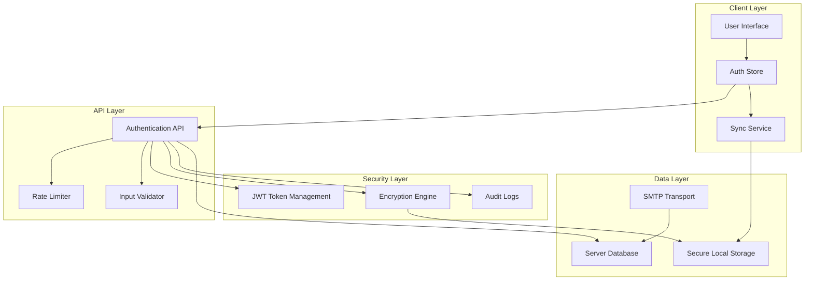

**Diagram sources**
- [auth.ts:1-52](file://src/server/utils/auth.ts#L1-L52)
- [encryption.ts:1-151](file://src/lib/encryption.ts#L1-L151)
- [secureDb.ts:1-166](file://src/lib/secureDb.ts#L1-L166)
- [rateLimit.ts:1-52](file://src/server/utils/rateLimit.ts#L1-L52)

## Authentication and Authorization

### JWT Token Implementation

The system uses JSON Web Tokens (JWT) for secure authentication with the following security features:

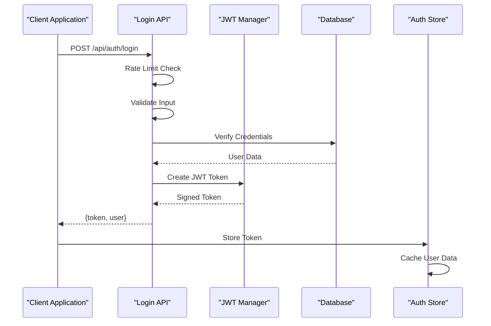

**Diagram sources**
- [login.ts:1-80](file://src/routes/api/auth/login.ts#L1-L80)
- [auth.ts:1-52](file://src/server/utils/auth.ts#L1-L52)
- [auth.store.ts:1-206](file://src/stores/auth.ts#L1-L206)

### Permission-Based Access Control

The authorization system implements role-based permissions with administrative bypass capabilities:

| Role | Permissions | Description |
|------|-------------|-------------|
| Admin | All permissions | Full system access |
| Manager | Limited permissions | Outlet-specific operations |
| Cashier | Basic sales permissions | Transaction processing only |

**Section sources**
- [auth.ts:32-51](file://src/server/utils/auth.ts#L32-L51)
- [schema.ts:4-25](file://src/server/db/schema.ts#L4-L25)

### Multi-Factor Authentication Flow

The system implements email-based verification with OTP (One-Time Password) security:

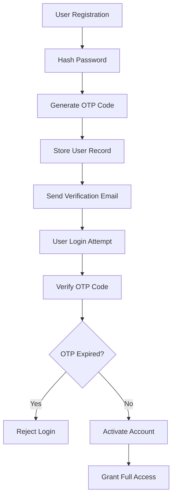

**Diagram sources**
- [register.ts:1-77](file://src/routes/api/auth/register.ts#L1-L77)
- [verify.ts:1-63](file://src/routes/api/auth/verify.ts#L1-L63)

**Section sources**
- [register.ts:40-56](file://src/routes/api/auth/register.ts#L40-L56)
- [verify.ts:34-51](file://src/routes/api/auth/verify.ts#L34-L51)

## Data Encryption and Storage

### End-to-End Encryption System

The secure database implementation provides comprehensive encryption for sensitive data:

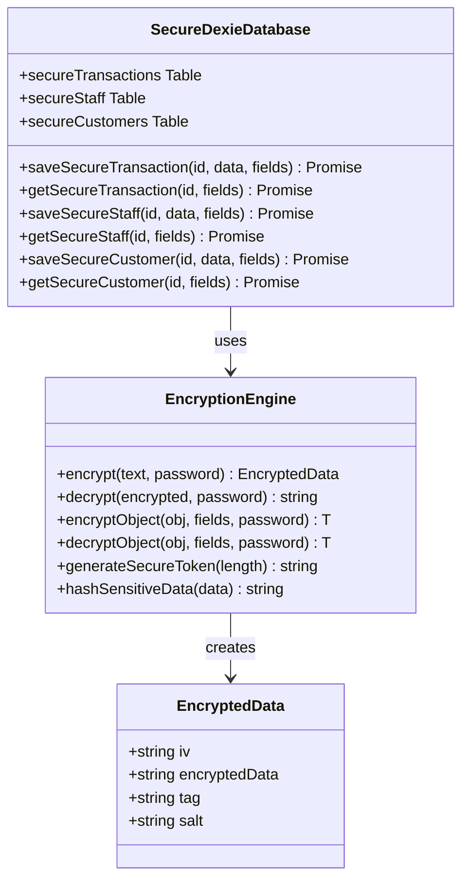

**Diagram sources**
- [encryption.ts:21-104](file://src/lib/encryption.ts#L21-L104)
- [secureDb.ts:29-132](file://src/lib/secureDb.ts#L29-L132)

### Sensitive Data Protection

The encryption system protects critical business information:

| Data Category | Sensitive Fields | Encryption Method |
|---------------|------------------|-------------------|
| Transactions | receiptNumber, paymentMethod, cashierName | AES-256-GCM |
| Staff | password, pin, otpCode | AES-256-GCM |
| Customers | phone, email | AES-256-GCM |

**Section sources**
- [encryption.ts:135-151](file://src/lib/encryption.ts#L135-L151)
- [secureDb.ts:55-129](file://src/lib/secureDb.ts#L55-L129)

### Local Storage Security

The secure database implementation includes device identification and migration capabilities:

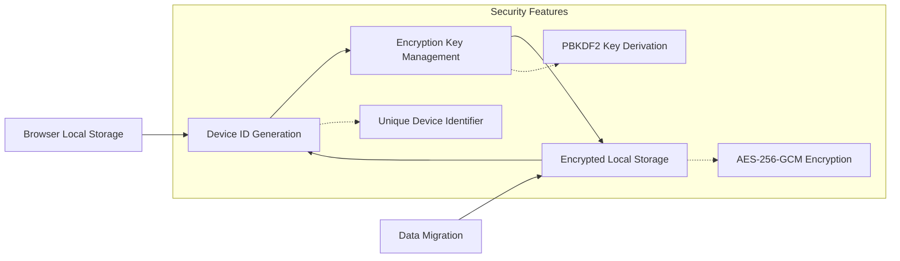

**Diagram sources**
- [secureDb.ts:44-53](file://src/lib/secureDb.ts#L44-L53)
- [encryption.ts:108-125](file://src/lib/encryption.ts#L108-L125)

**Section sources**
- [secureDb.ts:134-153](file://src/lib/secureDb.ts#L134-L153)

## Rate Limiting and Input Validation

### Rate Limiting Implementation

The system implements sliding window rate limiting to prevent brute force attacks and API abuse:

| Endpoint | Attempts | Time Window | Action |
|----------|----------|-------------|---------|
| Login | 5 | 60 seconds | Block after 5 failed attempts |
| Registration | 3 | 15 minutes | Block after 3 failed attempts |
| Email Verification | 5 | 60 seconds | Block after 5 failed attempts |

**Section sources**
- [rateLimit.ts:22-34](file://src/server/utils/rateLimit.ts#L22-L34)
- [login.ts:17-20](file://src/routes/api/auth/login.ts#L17-L20)
- [register.ts:13-15](file://src/routes/api/auth/register.ts#L13-L15)
- [verify.ts:10-12](file://src/routes/api/auth/verify.ts#L10-L12)

### Input Validation System

Comprehensive input validation ensures data integrity and prevents injection attacks:

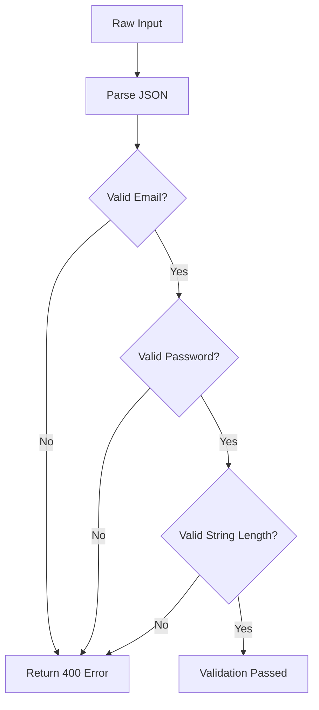

**Diagram sources**
- [validation.ts:38-49](file://src/server/utils/validation.ts#L38-L49)

**Section sources**
- [validation.ts:27-35](file://src/server/utils/validation.ts#L27-L35)
- [validation.ts:12-14](file://src/server/utils/validation.ts#L12-L14)

## Audit Logging

### Comprehensive Audit Trail

The audit logging system tracks all significant system activities for compliance and security monitoring:

| Audit Event Type | Description | Trigger Conditions |
|------------------|-------------|-------------------|
| LOGIN | User authentication attempts | Successful/failed login events |
| CREATE | Data creation operations | New records creation |
| UPDATE | Data modification operations | Record updates |
| DELETE | Data deletion operations | Record removal |
| SYNC | Data synchronization events | Local-server sync operations |
| EXPORT | Data export operations | Report generation |
| BACKUP | System backup operations | Scheduled/Manual backups |

**Section sources**
- [schema-audit.ts:3-83](file://src/server/db/schema-audit.ts#L3-L83)
- [auditService.ts](file://src/server/utils/auditService.ts)

### Audit Data Structure

The audit log captures comprehensive metadata for each event:

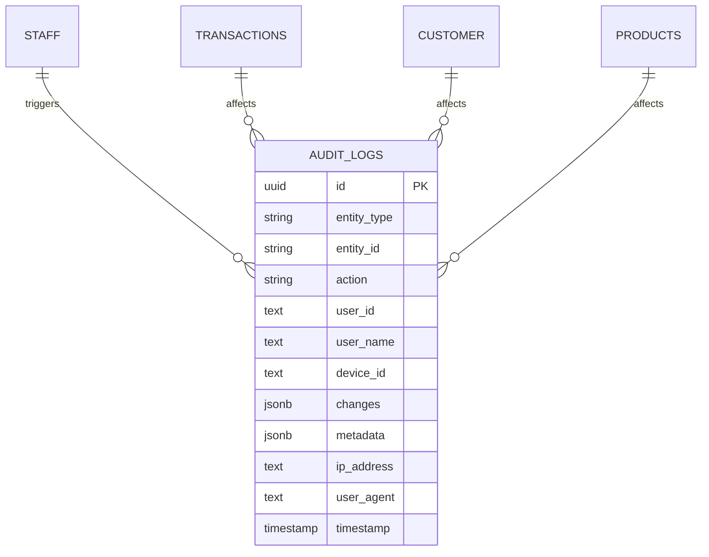

**Diagram sources**
- [schema-audit.ts:36-83](file://src/server/db/schema-audit.ts#L36-L83)

**Section sources**
- [schema-audit.ts:30-34](file://src/server/db/schema-audit.ts#L30-L34)

## Email Security

### Secure Email Delivery

The email system implements multiple security measures for authentication and communication:

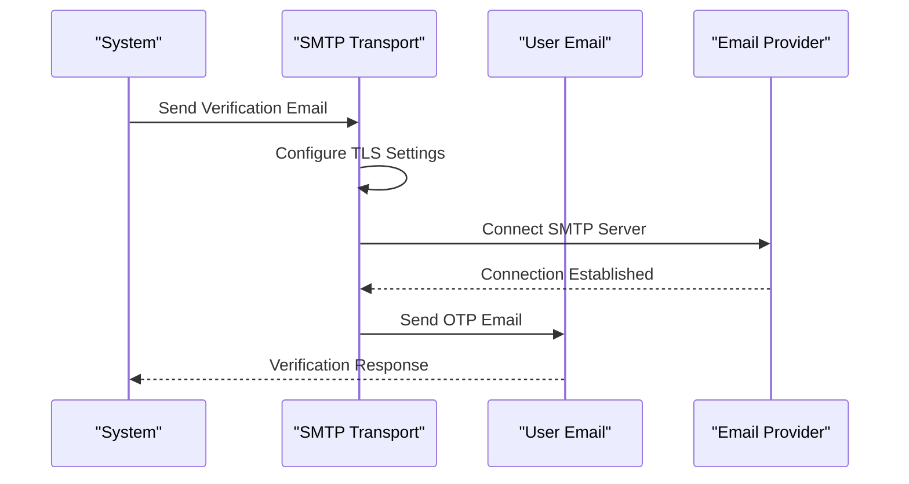

**Diagram sources**
- [mail.ts:12-29](file://src/server/utils/mail.ts#L12-L29)
- [mail.ts:42-87](file://src/server/utils/mail.ts#L42-L87)

### Email Security Features

| Security Feature | Implementation | Purpose |
|------------------|----------------|---------|
| TLS Encryption | TLS v1.2 minimum | Secure email transmission |
| Connection Timeout | 5 seconds | Prevent hanging connections |
| Message ID | UUID generation | Email tracking and deliverability |
| SPF/DKIM | Provider configuration | Anti-spoofing protection |
| Rate Limiting | Per-user email limits | Prevent spam abuse |

**Section sources**
- [mail.ts:25-28](file://src/server/utils/mail.ts#L25-L28)
- [mail.ts:34-37](file://src/server/utils/mail.ts#L34-L37)

## Conflict Resolution Security

### Distributed Data Consistency

The conflict resolution system ensures data integrity in distributed environments:

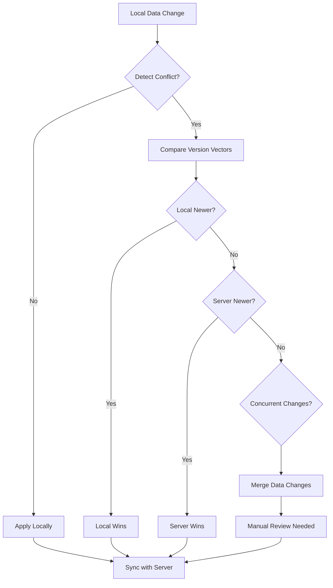

**Diagram sources**
- [conflictResolution.ts:142-168](file://src/lib/conflictResolution.ts#L142-L168)
- [conflictResolution.ts:229-242](file://src/lib/conflictResolution.ts#L229-L242)

### Version Vector Management

The system maintains distributed version vectors for conflict detection:

| Version Vector Component | Description | Security Benefit |
|-------------------------|-------------|------------------|
| Device ID | Unique device identifier | Prevent cross-device tampering |
| Timestamp | Operation timing | Detect chronological order |
| Counter | Operation sequence | Prevent replay attacks |
| Hash | Data integrity | Detect unauthorized modifications |

**Section sources**
- [conflictResolution.ts:20-31](file://src/lib/conflictResolution.ts#L20-L31)
- [conflictResolution.ts:134-140](file://src/lib/conflictResolution.ts#L134-L140)

## Mobile Device Security

### Device-Based Security

The system implements device-specific security measures for mobile applications:

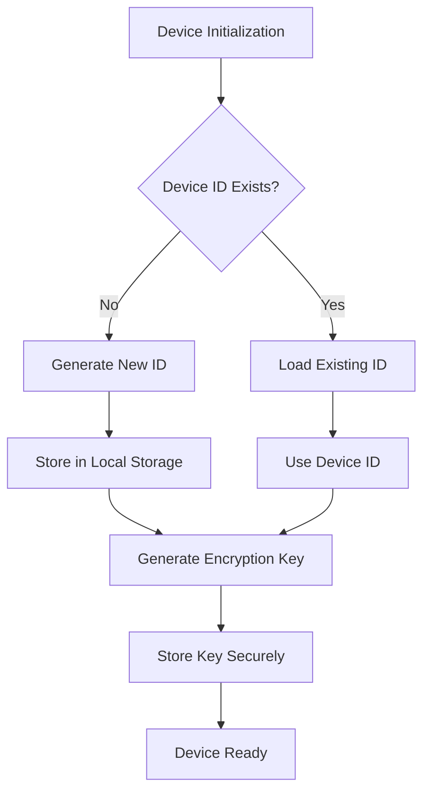

**Diagram sources**
- [secureDb.ts:44-53](file://src/lib/secureDb.ts#L44-L53)
- [encryption.ts:108-125](file://src/lib/encryption.ts#L108-L125)

### Local Data Protection

Mobile devices implement comprehensive local data security:

| Security Measure | Implementation | Protection Level |
|------------------|----------------|------------------|
| Local Encryption | AES-256-GCM | High |
| Device Binding | Device ID correlation | Medium |
| Session Management | Token expiration | Medium |
| Data Minimization | Only sensitive data encrypted | High |
| Automatic Logout | Inactivity timeout | Medium |

**Section sources**
- [secureDb.ts:44-53](file://src/lib/secureDb.ts#L44-L53)
- [auth.store.ts:13-56](file://src/stores/auth.ts#L13-L56)

## Security Best Practices

### Implementation Guidelines

The ngepos system follows industry-standard security practices:

1. **Defense in Depth**: Multiple security layers work together
2. **Zero Trust**: Never trust any component implicitly
3. **Least Privilege**: Users have minimal required permissions
4. **Audit Everything**: All actions are logged and monitored
5. **Fail Securely**: Systems fail closed when errors occur

### Security Monitoring

Continuous monitoring and alerting systems track security events:

| Monitor Type | Detection Criteria | Response Action |
|--------------|-------------------|-----------------|
| Login Attempts | Multiple failed attempts | Account lockout |
| API Abuse | Rate limit violations | Temporary ban |
| Data Access | Unauthorized access attempts | Security alert |
| System Errors | Cryptographic failures | Immediate investigation |
| Network Issues | Connection timeouts | Health check |

**Section sources**
- [rateLimit.ts:8-13](file://src/server/utils/rateLimit.ts#L8-L13)
- [auth.ts:12-18](file://src/server/utils/auth.ts#L12-L18)

## Troubleshooting Guide

### Common Security Issues

| Issue | Symptoms | Solution |
|-------|----------|----------|
| Authentication Failures | 401 Unauthorized errors | Check JWT token validity |
| Rate Limit Exceeded | 429 Too Many Requests | Wait for cooldown period |
| Email Delivery Issues | Verification emails not received | Check SMTP configuration |
| Data Encryption Errors | Unable to decrypt records | Verify encryption keys |
| Permission Denied | 403 Forbidden errors | Check user role permissions |

### Debugging Security Events

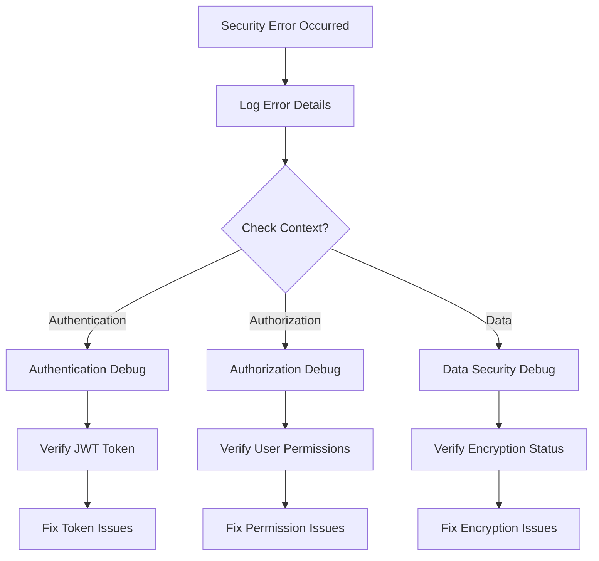

**Diagram sources**
- [auth.ts:21-29](file://src/server/utils/auth.ts#L21-L29)
- [me.ts:45-50](file://src/routes/api/auth/me.ts#L45-L50)

**Section sources**
- [auth.ts:12-18](file://src/server/utils/auth.ts#L12-L18)
- [login.ts:75-78](file://src/routes/api/auth/login.ts#L75-L78)

## Conclusion

The ngepos security system provides comprehensive protection through multiple layers of defense. Key security achievements include:

- **Strong Authentication**: JWT-based authentication with role-based authorization
- **Data Protection**: End-to-end encryption for sensitive business data
- **Attack Prevention**: Rate limiting and comprehensive input validation
- **Compliance**: Complete audit trail for all system activities
- **Resilience**: Conflict resolution and data consistency mechanisms

The implementation demonstrates best practices in modern web application security while maintaining usability and performance. Regular security audits and updates will ensure continued protection against emerging threats.