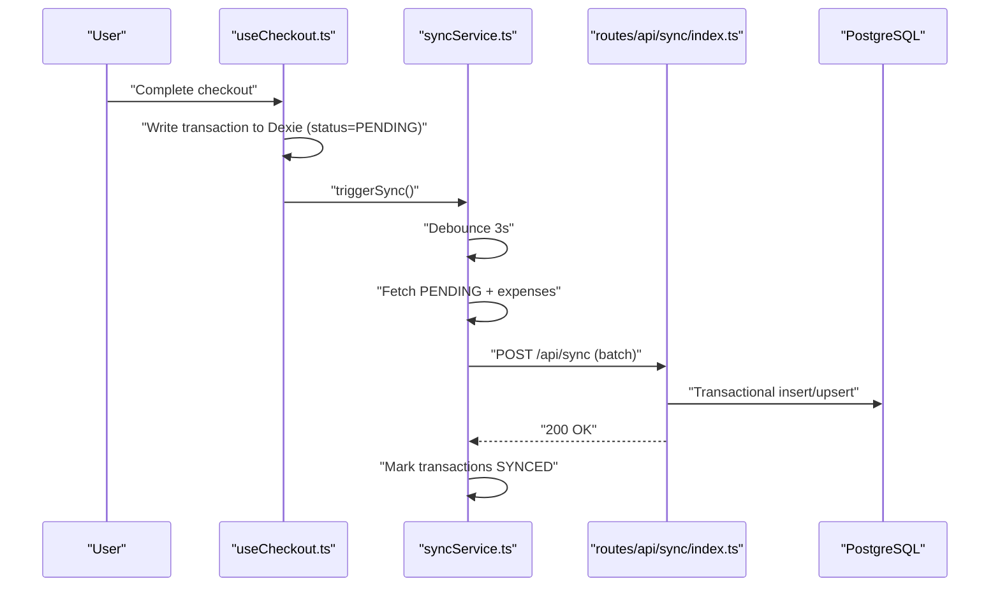
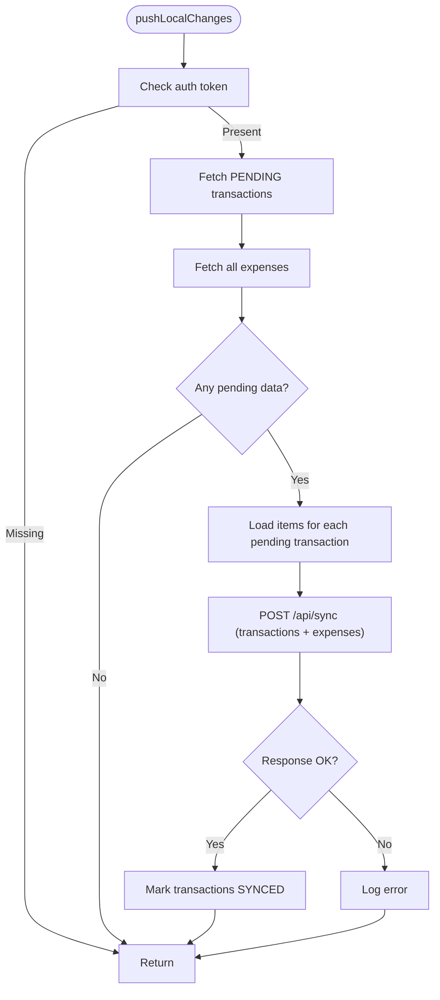
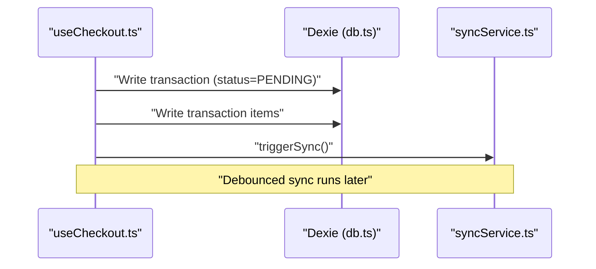
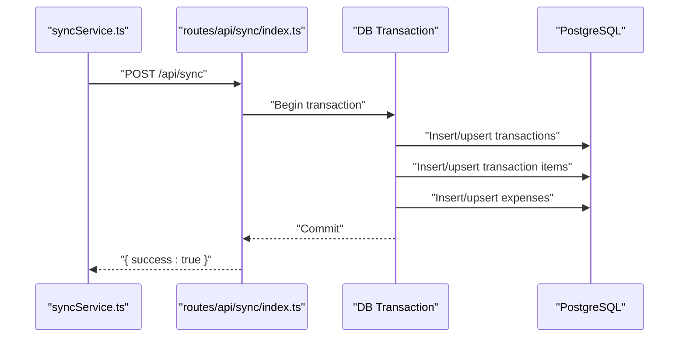
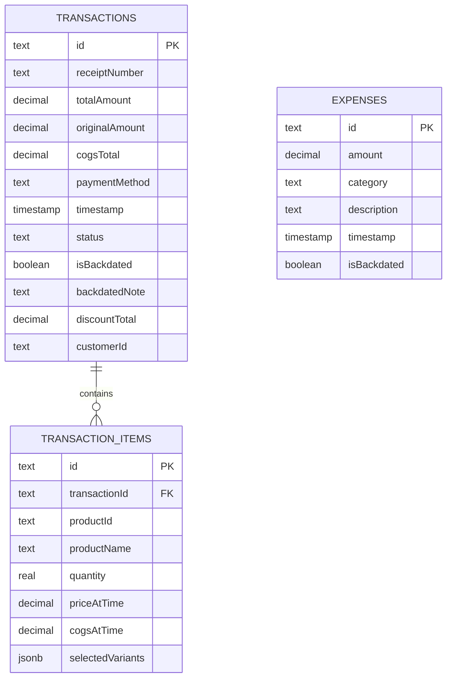
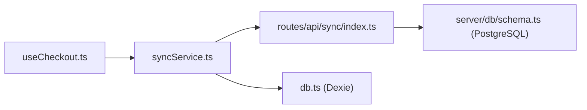

# Synchronization Service

<cite>
**Referenced Files in This Document**
- [syncService.ts](file://src/lib/syncService.ts)
- [db.ts](file://src/db/db.ts)
- [index.ts](file://src/routes/api/sync/index.ts)
- [useCheckout.ts](file://src/hooks/useCheckout.ts)
- [schema.ts](file://src/server/db/schema.ts)
</cite>

## Table of Contents
1. [Introduction](#introduction)
2. [Project Structure](#project-structure)
3. [Core Components](#core-components)
4. [Architecture Overview](#architecture-overview)
5. [Detailed Component Analysis](#detailed-component-analysis)
6. [Dependency Analysis](#dependency-analysis)
7. [Performance Considerations](#performance-considerations)
8. [Troubleshooting Guide](#troubleshooting-guide)
9. [Conclusion](#conclusion)

## Introduction
This document explains the synchronization service in the NgePos POS system with an offline-first design. It covers how local changes are captured and queued for synchronization, how the pushLocalChanges function coordinates transaction and expense synchronization, the debounced sync mechanism, queue processing, batch handling, error recovery, conflict resolution patterns, and integration with the IndexedDB-like Dexie database layer. Practical examples of sync triggers and debugging approaches are included to help developers maintain and extend the system.

## Project Structure
The synchronization pipeline spans three layers:
- Frontend service: collects local changes and triggers sync
- API endpoint: receives batches and writes to the database transactionally
- Database layer: IndexedDB via Dexie on the client and PostgreSQL on the server

```mermaid
graph TB
subgraph "Frontend"
SC["syncService.ts<br/>pushLocalChanges(), triggerSync()"]
UC["useCheckout.ts<br/>submitTransaction()"]
DB["db.ts<br/>Dexie schema & tables"]
end
subgraph "Server"
API["routes/api/sync/index.ts<br/>POST handler"]
PG["server/db/schema.ts<br/>PostgreSQL tables"]
end
UC --> SC
SC --> API
API --> PG
DB <- --> SC
```

**Diagram sources**
- [syncService.ts:1-110](file://src/lib/syncService.ts#L1-L110)
- [useCheckout.ts:1-234](file://src/hooks/useCheckout.ts#L1-L234)
- [db.ts:270-498](file://src/db/db.ts#L270-L498)
- [index.ts:1-102](file://src/routes/api/sync/index.ts#L1-L102)
- [schema.ts:34-81](file://src/server/db/schema.ts#L34-L81)

**Section sources**
- [syncService.ts:1-110](file://src/lib/syncService.ts#L1-L110)
- [useCheckout.ts:1-234](file://src/hooks/useCheckout.ts#L1-L234)
- [db.ts:270-498](file://src/db/db.ts#L270-L498)
- [index.ts:1-102](file://src/routes/api/sync/index.ts#L1-L102)
- [schema.ts:34-81](file://src/server/db/schema.ts#L34-L81)

## Core Components
- syncService: orchestrates fetching pending transactions, enriching with items, sending to the backend, and marking synced locally.
- useCheckout: creates transactions with PENDING status and triggers background sync.
- Server sync endpoint: validates auth, inserts/upserts transactions and items, and upserts expenses in a single transaction.
- Dexie schema: defines local tables and indexes used by the frontend.
- PostgreSQL schema: defines server-side tables and indexes used by the backend.

Key responsibilities:
- Offline-first capture: transactions are stored locally with PENDING status until synchronized.
- Batch processing: transactions and items are sent together; expenses are sent as a batch.
- Conflict resolution: upsert semantics on the server ensure idempotency.
- Debounced sync: repeated actions coalesce into a single sync after a short delay.

**Section sources**
- [syncService.ts:5-57](file://src/lib/syncService.ts#L5-L57)
- [useCheckout.ts:38-213](file://src/hooks/useCheckout.ts#L38-L213)
- [index.ts:10-92](file://src/routes/api/sync/index.ts#L10-L92)
- [db.ts:82-137](file://src/db/db.ts#L82-L137)
- [schema.ts:34-81](file://src/server/db/schema.ts#L34-L81)

## Architecture Overview
The system follows an offline-first pattern:
- Local changes are written to Dexie immediately.
- A debounced sync periodically sends pending data to the server.
- The server persists data transactionally and marks records as SYNCED on success.



**Diagram sources**
- [useCheckout.ts:201-203](file://src/hooks/useCheckout.ts#L201-L203)
- [syncService.ts:50-57](file://src/lib/syncService.ts#L50-L57)
- [syncService.ts:5-47](file://src/lib/syncService.ts#L5-L47)
- [index.ts:10-92](file://src/routes/api/sync/index.ts#L10-L92)

## Detailed Component Analysis

### syncService: pushLocalChanges and triggerSync
Responsibilities:
- Fetch pending transactions (status=PENDING) and all expenses.
- Enrich transactions with items from transactionItems.
- Send a batch to /api/sync with Authorization header.
- On success, mark transactions as SYNCED.

Debounced sync:
- A timeout prevents rapid successive sync attempts.
- Repeated calls reset the timer, ensuring a quiet period before sending.

Error handling:
- Errors are logged; no user-facing toast is emitted in the service.



**Diagram sources**
- [syncService.ts:5-47](file://src/lib/syncService.ts#L5-L47)

**Section sources**
- [syncService.ts:5-57](file://src/lib/syncService.ts#L5-L57)

### useCheckout: Transaction Creation and Sync Trigger
Responsibilities:
- Build transaction and items, compute costs and discounts, and write to Dexie inside a transaction.
- Set status to PENDING for the transaction.
- Trigger background sync via syncService.triggerSync.

Integration with sync:
- After successful checkout, the service is imported dynamically and triggerSync is called.



**Diagram sources**
- [useCheckout.ts:57-172](file://src/hooks/useCheckout.ts#L57-L172)
- [useCheckout.ts:201-203](file://src/hooks/useCheckout.ts#L201-L203)
- [syncService.ts:50-57](file://src/lib/syncService.ts#L50-L57)

**Section sources**
- [useCheckout.ts:38-213](file://src/hooks/useCheckout.ts#L38-L213)

### Server Sync Endpoint: Transactional Upserts
Responsibilities:
- Verify Authorization (Bearer token).
- Accept a batch of transactions and expenses.
- Perform a server-side transaction:
  - Upsert transactions and items (idempotent).
  - Upsert expenses (idempotent).
- Return success on completion.

Conflict resolution:
- Uses upsert-on-conflict semantics to handle duplicates and re-syncs safely.



**Diagram sources**
- [index.ts:14-92](file://src/routes/api/sync/index.ts#L14-L92)
- [schema.ts:34-81](file://src/server/db/schema.ts#L34-L81)

**Section sources**
- [index.ts:10-92](file://src/routes/api/sync/index.ts#L10-L92)

### Database Layer: Dexie (Client) and PostgreSQL (Server)
Client schema highlights:
- Transactions include status with PENDING/SYNCED.
- Transaction items link to transactions.
- Expenses are stored locally for sync.

Server schema highlights:
- Transactions and items are normalized with foreign keys.
- Expenses are normalized with timestamps and categorization.
- Indexes support common queries.



**Diagram sources**
- [db.ts:82-137](file://src/db/db.ts#L82-L137)
- [schema.ts:34-81](file://src/server/db/schema.ts#L34-L81)

**Section sources**
- [db.ts:82-137](file://src/db/db.ts#L82-L137)
- [schema.ts:34-81](file://src/server/db/schema.ts#L34-L81)

## Dependency Analysis
- Frontend depends on Dexie for local storage and on the server API for persistence.
- The server depends on Drizzle ORM and PostgreSQL.
- The checkout flow depends on the sync service to keep offline-first behavior.



**Diagram sources**
- [useCheckout.ts:201-203](file://src/hooks/useCheckout.ts#L201-L203)
- [syncService.ts:1-110](file://src/lib/syncService.ts#L1-L110)
- [index.ts:1-102](file://src/routes/api/sync/index.ts#L1-L102)
- [db.ts:270-498](file://src/db/db.ts#L270-L498)
- [schema.ts:34-81](file://src/server/db/schema.ts#L34-L81)

**Section sources**
- [useCheckout.ts:201-203](file://src/hooks/useCheckout.ts#L201-L203)
- [syncService.ts:1-110](file://src/lib/syncService.ts#L1-L110)
- [index.ts:1-102](file://src/routes/api/sync/index.ts#L1-L102)
- [db.ts:270-498](file://src/db/db.ts#L270-L498)
- [schema.ts:34-81](file://src/server/db/schema.ts#L34-L81)

## Performance Considerations
- Debounced sync: A 3-second delay coalesces bursts of activity and reduces server load.
- Batch requests: Sending transactions with items and expenses together minimizes round-trips.
- Upsert semantics: Idempotent writes reduce retries and duplicate processing.
- Indexes: PostgreSQL indexes on frequently queried columns improve upsert performance.
- Local writes: Dexie operations are fast; batching and debouncing prevent UI jank.

[No sources needed since this section provides general guidance]

## Troubleshooting Guide
Common issues and resolutions:
- No sync occurs:
  - Ensure an auth token exists in local storage.
  - Verify that transactions have status PENDING.
  - Confirm that triggerSync is being called after checkout.
- Sync fails:
  - Check server logs for errors during transaction processing.
  - Inspect payload shape for transactions and items.
  - Validate that Authorization header is present and correct.
- Conflicts or duplicates:
  - Rely on upsert semantics; re-running sync is safe.
  - If items are missing, confirm that transactionItems were fetched for each pending transaction.
- Debugging steps:
  - Add logging around fetch and response handling in pushLocalChanges.
  - Monitor network tab for /api/sync requests and responses.
  - Inspect Dexie transaction status updates and PostgreSQL rows after sync.

**Section sources**
- [syncService.ts:5-47](file://src/lib/syncService.ts#L5-L47)
- [index.ts:10-92](file://src/routes/api/sync/index.ts#L10-L92)

## Conclusion
The NgePos synchronization service implements a robust offline-first architecture. Local changes are captured immediately, marked as PENDING, and synchronized in batches with a debounced mechanism. The server performs idempotent upserts to resolve conflicts safely. Together, these patterns deliver reliability, performance, and a smooth user experience in disconnected or intermittent network conditions.