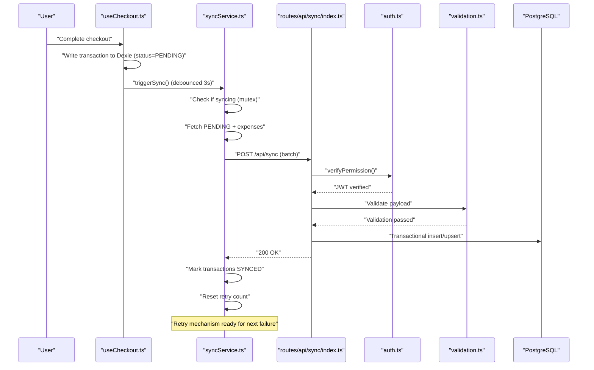
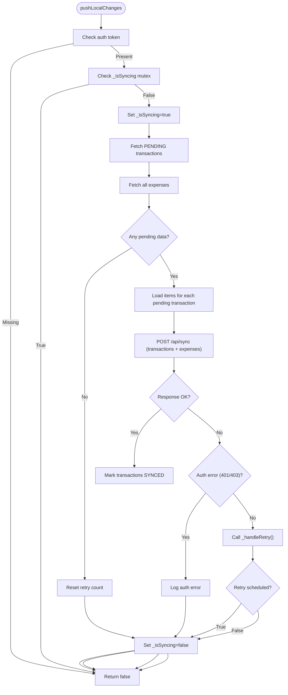
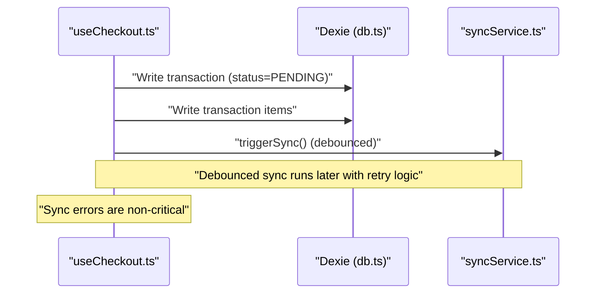
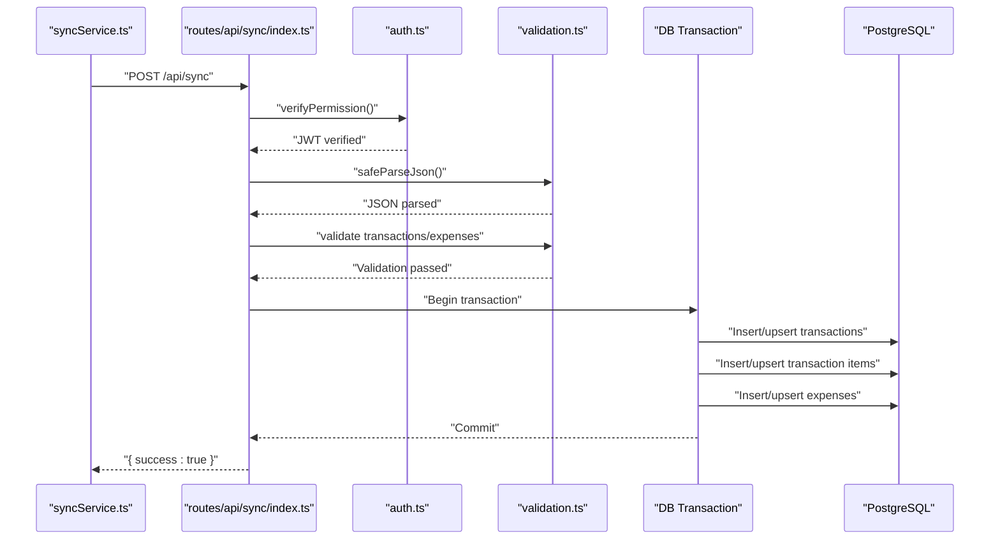
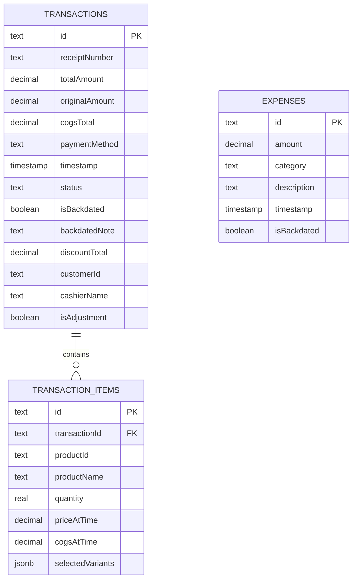
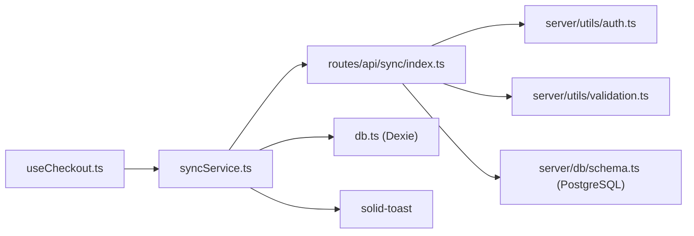

# Synchronization Service

<cite>
**Referenced Files in This Document**
- [syncService.ts](file://src/lib/syncService.ts)
- [db.ts](file://src/db/db.ts)
- [index.ts](file://src/routes/api/sync/index.ts)
- [useCheckout.ts](file://src/hooks/useCheckout.ts)
- [schema.ts](file://src/server/db/schema.ts)
- [validation.ts](file://src/server/utils/validation.ts)
- [auth.ts](file://src/server/utils/auth.ts)
</cite>

## Update Summary
**Changes Made**
- Enhanced sync service with automatic retry mechanisms using exponential backoff
- Implemented debounced triggering to prevent server overload
- Added comprehensive error handling with user notifications
- Improved retry logic with configurable maximum attempts and delays
- Enhanced authentication error handling with logout capability
- Added rate limiting protection on the server side

## Table of Contents
1. [Introduction](#introduction)
2. [Project Structure](#project-structure)
3. [Core Components](#core-components)
4. [Architecture Overview](#architecture-overview)
5. [Detailed Component Analysis](#detailed-component-analysis)
6. [Enhanced Retry Mechanism](#enhanced-retry-mechanism)
7. [Debounced Sync Implementation](#debounced-sync-implementation)
8. [Error Handling and Recovery](#error-handling-and-recovery)
9. [Dependency Analysis](#dependency-analysis)
10. [Performance Considerations](#performance-considerations)
11. [Troubleshooting Guide](#troubleshooting-guide)
12. [Conclusion](#conclusion)

## Introduction
This document explains the enhanced synchronization service in the NgePos POS system with an offline-first design. The service now features automatic retry mechanisms using exponential backoff, debounced triggering to prevent server overload, and comprehensive error handling. It covers how local changes are captured and queued for synchronization, how the pushLocalChanges function coordinates transaction and expense synchronization, the enhanced retry logic, queue processing, batch handling, error recovery strategies, conflict resolution patterns, and integration with the IndexedDB-like Dexie database layer. Practical examples of sync triggers and debugging approaches are included to help developers maintain and extend the system.

## Project Structure
The synchronization pipeline spans three layers with enhanced error handling and retry mechanisms:
- Frontend service: collects local changes and triggers sync with automatic retry
- API endpoint: receives batches with rate limiting and comprehensive validation
- Database layer: IndexedDB via Dexie on the client and PostgreSQL on the server

```mermaid
graph TB
subgraph "Frontend Enhanced"
SC["syncService.ts<br/>pushLocalChanges(), triggerSync()<br/>Exponential Backoff Retry"]
UC["useCheckout.ts<br/>submitTransaction()"]
DB["db.ts<br/>Dexie schema & tables"]
TOAST["solid-toast<br/>User Notifications"]
end
subgraph "Server Enhanced"
API["routes/api/sync/index.ts<br/>POST handler<br/>Rate Limiting & Validation"]
AUTH["server/utils/auth.ts<br/>Permission Verification"]
VALID["server/utils/validation.ts<br/>Payload Validation"]
PG["server/db/schema.ts<br/>PostgreSQL tables"]
end
UC --> SC
SC --> TOAST
SC --> API
API --> AUTH
API --> VALID
API --> PG
DB <- --> SC
```

**Diagram sources**
- [syncService.ts:1-111](file://src/lib/syncService.ts#L1-L111)
- [useCheckout.ts:1-267](file://src/hooks/useCheckout.ts#L1-L267)
- [db.ts:270-498](file://src/db/db.ts#L270-L498)
- [index.ts:1-155](file://src/routes/api/sync/index.ts#L1-L155)
- [auth.ts:1-52](file://src/server/utils/auth.ts#L1-L52)
- [validation.ts:1-89](file://src/server/utils/validation.ts#L1-L89)
- [schema.ts:34-81](file://src/server/db/schema.ts#L34-L81)

**Section sources**
- [syncService.ts:1-111](file://src/lib/syncService.ts#L1-L111)
- [useCheckout.ts:1-267](file://src/hooks/useCheckout.ts#L1-L267)
- [db.ts:270-498](file://src/db/db.ts#L270-L498)
- [index.ts:1-155](file://src/routes/api/sync/index.ts#L1-L155)
- [auth.ts:1-52](file://src/server/utils/auth.ts#L1-L52)
- [validation.ts:1-89](file://src/server/utils/validation.ts#L1-L89)
- [schema.ts:34-81](file://src/server/db/schema.ts#L34-L81)

## Core Components
- **Enhanced syncService**: orchestrates fetching pending transactions, enriching with items, sending to the backend with retry logic, and marking synced locally.
- **useCheckout**: creates transactions with PENDING status and triggers background sync with error handling.
- **Server sync endpoint**: validates auth with permission checks, inserts/upserts transactions and items with comprehensive validation, and upserts expenses in a single transaction with rate limiting.
- **Dexie schema**: defines local tables and indexes used by the frontend.
- **PostgreSQL schema**: defines server-side tables and indexes used by the backend.
- **Validation utilities**: provide comprehensive payload validation for sync operations.
- **Authentication utilities**: handle JWT verification and permission checking.

Key responsibilities:
- **Offline-first capture**: transactions are stored locally with PENDING status until synchronized.
- **Batch processing**: transactions and items are sent together; expenses are sent as a batch.
- **Conflict resolution**: upsert semantics on the server ensure idempotency.
- **Enhanced debounced sync**: repeated actions coalesce into a single sync after a 3-second delay.
- **Automatic retry with exponential backoff**: failed sync attempts retry with increasing delays.
- **Comprehensive error handling**: differentiates between auth errors, server errors, and network issues.

**Section sources**
- [syncService.ts:1-111](file://src/lib/syncService.ts#L1-L111)
- [useCheckout.ts:38-267](file://src/hooks/useCheckout.ts#L38-L267)
- [index.ts:10-155](file://src/routes/api/sync/index.ts#L10-L155)
- [db.ts:82-137](file://src/db/db.ts#L82-L137)
- [schema.ts:34-81](file://src/server/db/schema.ts#L34-L81)
- [validation.ts:51-89](file://src/server/utils/validation.ts#L51-L89)
- [auth.ts:31-51](file://src/server/utils/auth.ts#L31-L51)

## Architecture Overview
The system follows an enhanced offline-first pattern with robust error handling:
- Local changes are written to Dexie immediately with PENDING status.
- A debounced sync periodically sends pending data to the server with retry logic.
- The server persists data transactionally and marks records as SYNCED on success.
- Automatic retry mechanisms handle transient failures with exponential backoff.
- Comprehensive error handling provides user feedback and graceful degradation.



**Diagram sources**
- [useCheckout.ts:226-233](file://src/hooks/useCheckout.ts#L226-L233)
- [syncService.ts:102-111](file://src/lib/syncService.ts#L102-L111)
- [syncService.ts:12-75](file://src/lib/syncService.ts#L12-L75)
- [index.ts:20-155](file://src/routes/api/sync/index.ts#L20-L155)
- [auth.ts:31-51](file://src/server/utils/auth.ts#L31-L51)
- [validation.ts:51-89](file://src/server/utils/validation.ts#L51-L89)

## Detailed Component Analysis

### Enhanced syncService: pushLocalChanges and triggerSync
**Updated** Enhanced with automatic retry mechanisms, debounced triggering, and comprehensive error handling.

Responsibilities:
- Fetch pending transactions (status=PENDING) and all expenses.
- Enrich transactions with items from transactionItems.
- Send a batch to /api/sync with Authorization header.
- On success, mark transactions as SYNCED.
- Implement mutex to prevent concurrent sync operations.
- Handle authentication errors differently from server errors.

Debounced sync:
- A timeout prevents rapid successive sync attempts.
- Repeated calls reset the timer, ensuring a quiet period before sending.

Enhanced error handling:
- Authentication errors (401/403) trigger immediate failure without retry.
- Network errors and server errors trigger exponential backoff retry.
- Maximum retry attempts configurable (default: 5).
- User notifications for persistent failures.



**Diagram sources**
- [syncService.ts:12-75](file://src/lib/syncService.ts#L12-L75)

**Section sources**
- [syncService.ts:1-111](file://src/lib/syncService.ts#L1-L111)

### Enhanced useCheckout: Transaction Creation and Sync Trigger
**Updated** Enhanced with improved error handling and non-critical sync failures.

Responsibilities:
- Build transaction and items, compute costs and discounts, and write to Dexie inside a transaction.
- Set status to PENDING for the transaction.
- Trigger background sync via syncService.triggerSync with error handling.
- Handle sync trigger errors gracefully without blocking checkout.

Integration with enhanced sync:
- After successful checkout, the service is imported dynamically and triggerSync is called.
- Sync trigger errors are caught and logged as non-critical.
- Users receive appropriate feedback for sync failures.



**Diagram sources**
- [useCheckout.ts:169-184](file://src/hooks/useCheckout.ts#L169-L184)
- [useCheckout.ts:226-233](file://src/hooks/useCheckout.ts#L226-L233)
- [syncService.ts:102-111](file://src/lib/syncService.ts#L102-L111)

**Section sources**
- [useCheckout.ts:38-267](file://src/hooks/useCheckout.ts#L38-L267)

### Enhanced Server Sync Endpoint: Transactional Upserts with Validation
**Updated** Enhanced with comprehensive validation, rate limiting, and improved error handling.

Responsibilities:
- Verify Authorization with permission checking (Bearer token).
- Validate JSON payload with comprehensive validation utilities.
- Accept a batch of transactions and expenses with strict validation.
- Perform a server-side transaction with upsert semantics.
- Implement rate limiting to prevent abuse.
- Return success on completion with detailed logging.

Enhanced validation:
- Validates transaction arrays and individual transaction structures.
- Validates transaction items arrays and individual item structures.
- Validates expense arrays and individual expense structures.
- Provides detailed error messages for invalid payloads.

Rate limiting:
- Limits sync operations to 20 per minute per IP address.
- Prevents server overload from excessive sync attempts.

Conflict resolution:
- Uses upsert-on-conflict semantics to handle duplicates and re-syncs safely.
- Transactional processing ensures data consistency.



**Diagram sources**
- [index.ts:20-155](file://src/routes/api/sync/index.ts#L20-L155)
- [auth.ts:31-51](file://src/server/utils/auth.ts#L31-L51)
- [validation.ts:37-89](file://src/server/utils/validation.ts#L37-L89)
- [schema.ts:34-81](file://src/server/db/schema.ts#L34-L81)

**Section sources**
- [index.ts:10-155](file://src/routes/api/sync/index.ts#L10-L155)

### Database Layer: Dexie (Client) and PostgreSQL (Server)
**Updated** Enhanced with improved schema definitions and status handling.

Client schema highlights:
- Transactions include status with PENDING/SYNCED states.
- Transaction items link to transactions with proper foreign key relationships.
- Expenses are stored locally with category enumeration and timestamps.
- Enhanced indexing for performance optimization.

Server schema highlights:
- Transactions and items are normalized with foreign keys and proper constraints.
- Expenses are normalized with timestamps, categories, and backdated support.
- Comprehensive indexes support common queries and performance optimization.
- Status field defaults to SYNCED for new records.



**Diagram sources**
- [db.ts:82-137](file://src/db/db.ts#L82-L137)
- [schema.ts:34-81](file://src/server/db/schema.ts#L34-L81)

**Section sources**
- [db.ts:82-137](file://src/db/db.ts#L82-L137)
- [schema.ts:34-81](file://src/server/db/schema.ts#L34-L81)

## Enhanced Retry Mechanism
**New Section** The sync service now implements sophisticated retry logic with exponential backoff.

Key features:
- **Configurable retry attempts**: Maximum 5 retry attempts by default.
- **Exponential backoff**: Base delay of 1 second with doubling for each retry attempt.
- **Jitter implementation**: Random 500ms jitter to prevent thundering herd effects.
- **Differentiated error handling**: Auth errors (401/403) don't trigger retries.
- **User notification**: Toast notifications for persistent failures.
- **Retry count management**: Resets on successful sync, persists on manual sync.

Retry calculation:
- Retry 1: 1000ms + random(0-500ms)
- Retry 2: 2000ms + random(0-500ms)
- Retry 3: 4000ms + random(0-500ms)
- Retry 4: 8000ms + random(0-500ms)
- Retry 5: 16000ms + random(0-500ms)

**Section sources**
- [syncService.ts:4-100](file://src/lib/syncService.ts#L4-L100)

## Debounced Sync Implementation
**New Section** The sync service implements debounced triggering to prevent server overload.

Key features:
- **3-second debounce delay**: Coalesces rapid successive sync attempts.
- **Timeout management**: Clears previous timeouts when new sync is triggered.
- **Prevents server flooding**: Ensures only one sync operation at a time.
- **Improves performance**: Reduces unnecessary network requests during burst activities.

Implementation details:
- Uses `_syncTimeout` to track debounce timer.
- Clears existing timeout before setting new one.
- Executes `pushLocalChanges()` after debounce period.
- Prevents concurrent sync operations with mutex (`_isSyncing`).

**Section sources**
- [syncService.ts:102-111](file://src/lib/syncService.ts#L102-L111)

## Error Handling and Recovery
**New Section** Comprehensive error handling strategies for different failure scenarios.

Error categories:
- **Authentication errors (401/403)**: Immediate failure, no retry attempted.
- **Network errors**: Trigger exponential backoff retry mechanism.
- **Server errors (500)**: Trigger exponential backoff retry mechanism.
- **Validation errors (400)**: Immediate failure, no retry attempted.
- **Rate limiting errors (429)**: Immediate failure, no retry attempted.

Recovery strategies:
- **User notifications**: Toast notifications for persistent failures.
- **Graceful degradation**: Sync failures don't block checkout operations.
- **State management**: Proper cleanup of sync state on completion or failure.
- **Logging**: Comprehensive error logging for debugging and monitoring.

**Section sources**
- [syncService.ts:60-100](file://src/lib/syncService.ts#L60-L100)
- [index.ts:142-155](file://src/routes/api/sync/index.ts#L142-L155)

## Dependency Analysis
**Updated** Enhanced dependencies with validation and authentication utilities.

- Frontend depends on Dexie for local storage, sync service for synchronization, and solid-toast for user notifications.
- The server depends on Drizzle ORM, PostgreSQL, JWT authentication, and validation utilities.
- The checkout flow depends on the enhanced sync service with improved error handling.
- Validation utilities provide comprehensive payload validation.
- Authentication utilities handle JWT verification and permission checking.



**Diagram sources**
- [useCheckout.ts:226-233](file://src/hooks/useCheckout.ts#L226-L233)
- [syncService.ts:1-111](file://src/lib/syncService.ts#L1-L111)
- [index.ts:1-155](file://src/routes/api/sync/index.ts#L1-L155)
- [db.ts:270-498](file://src/db/db.ts#L270-L498)
- [auth.ts:1-52](file://src/server/utils/auth.ts#L1-L52)
- [validation.ts:1-89](file://src/server/utils/validation.ts#L1-L89)
- [schema.ts:34-81](file://src/server/db/schema.ts#L34-L81)

**Section sources**
- [useCheckout.ts:226-233](file://src/hooks/useCheckout.ts#L226-L233)
- [syncService.ts:1-111](file://src/lib/syncService.ts#L1-L111)
- [index.ts:1-155](file://src/routes/api/sync/index.ts#L1-L155)
- [db.ts:270-498](file://src/db/db.ts#L270-L498)
- [auth.ts:1-52](file://src/server/utils/auth.ts#L1-L52)
- [validation.ts:1-89](file://src/server/utils/validation.ts#L1-L89)
- [schema.ts:34-81](file://src/server/db/schema.ts#L34-L81)

## Performance Considerations
**Updated** Enhanced performance optimizations with retry mechanisms and rate limiting.

- **Enhanced debounced sync**: A 3-second delay coalesces bursts of activity and reduces server load.
- **Exponential backoff**: Gradually increases retry delays to prevent server saturation.
- **Jitter implementation**: Randomizes retry timing to prevent coordinated retry storms.
- **Maximum retry limit**: Prevents infinite retry loops with configurable limits.
- **Batch requests**: Sending transactions with items and expenses together minimizes round-trips.
- **Upsert semantics**: Idempotent writes reduce retries and duplicate processing.
- **Rate limiting**: Server-side rate limiting prevents abuse and protects server resources.
- **Comprehensive validation**: Early validation prevents wasted server processing.
- **Indexes**: PostgreSQL indexes on frequently queried columns improve upsert performance.
- **Local writes**: Dexie operations are fast; batching and debouncing prevent UI jank.

## Troubleshooting Guide
**Updated** Enhanced troubleshooting guide with retry mechanism and error handling.

Common issues and resolutions:
- **No sync occurs**:
  - Ensure an auth token exists in local storage.
  - Verify that transactions have status PENDING.
  - Confirm that triggerSync is being called after checkout.
  - Check if sync is currently in progress (mutex prevents concurrent operations).
- **Sync fails with retry attempts**:
  - Check server logs for errors during transaction processing.
  - Inspect payload shape for transactions and items.
  - Validate that Authorization header is present and correct.
  - Monitor retry count and delays in console logs.
  - Verify network connectivity and server availability.
- **Persistent sync failures**:
  - Check if maximum retry attempts (default: 5) have been reached.
  - Look for authentication errors (401/403) indicating token issues.
  - Verify server rate limiting hasn't been exceeded.
  - Check for validation errors in payload structure.
- **Conflicts or duplicates**:
  - Rely on upsert semantics; re-running sync is safe.
  - If items are missing, confirm that transactionItems were fetched for each pending transaction.
  - Check transaction status is properly set to PENDING before sync.
- **Debugging steps**:
  - Add logging around fetch and response handling in pushLocalChanges.
  - Monitor network tab for /api/sync requests and responses.
  - Inspect Dexie transaction status updates and PostgreSQL rows after sync.
  - Check console for retry attempts and exponential backoff delays.
  - Verify authentication tokens and permissions on server side.
  - Monitor rate limiting status and adjust sync frequency if needed.

**Section sources**
- [syncService.ts:12-100](file://src/lib/syncService.ts#L12-L100)
- [index.ts:10-155](file://src/routes/api/sync/index.ts#L10-L155)

## Conclusion
The NgePos synchronization service now implements a robust offline-first architecture with enhanced reliability and performance. Local changes are captured immediately, marked as PENDING, and synchronized in batches with intelligent retry mechanisms using exponential backoff and debounced triggering. The server performs idempotent upserts with comprehensive validation and rate limiting to resolve conflicts safely. The enhanced error handling provides user feedback and graceful degradation, while the retry logic ensures eventual consistency even in challenging network conditions. Together, these patterns deliver improved reliability, performance, and user experience in disconnected or intermittent network conditions.