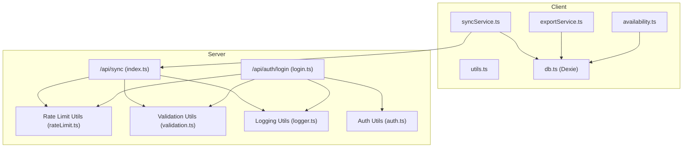
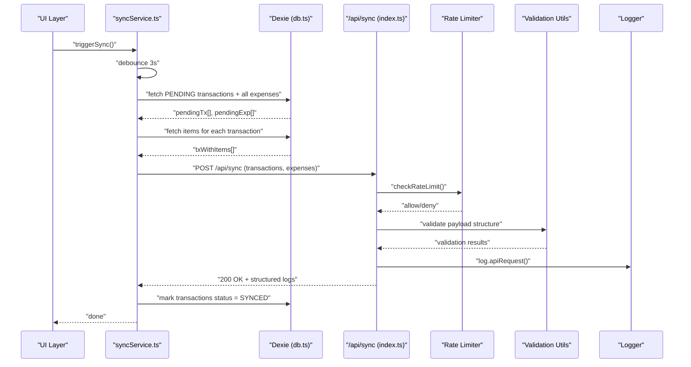
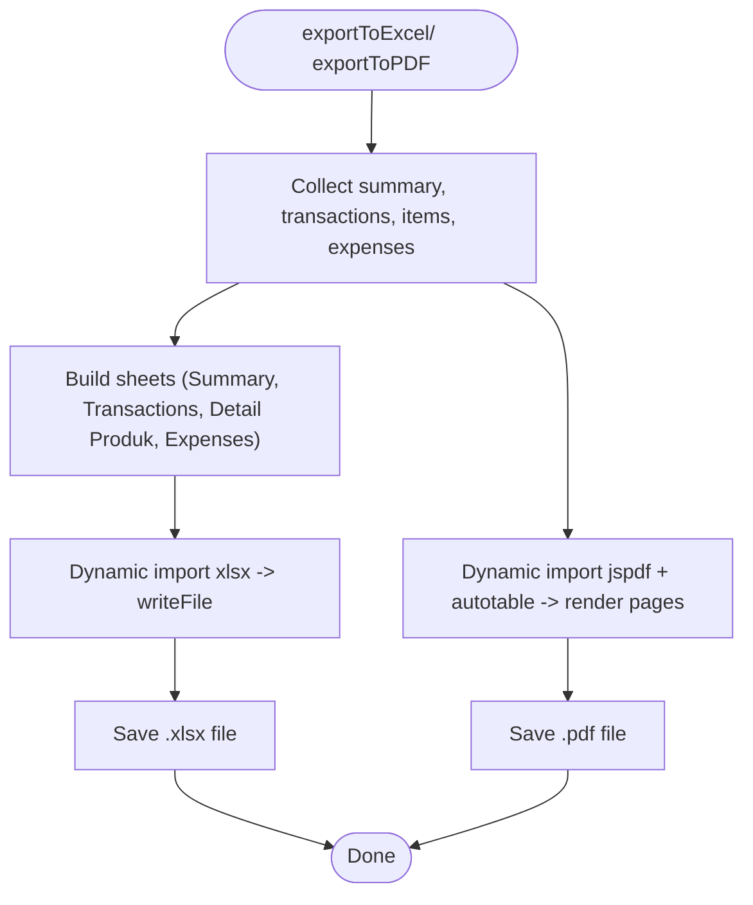
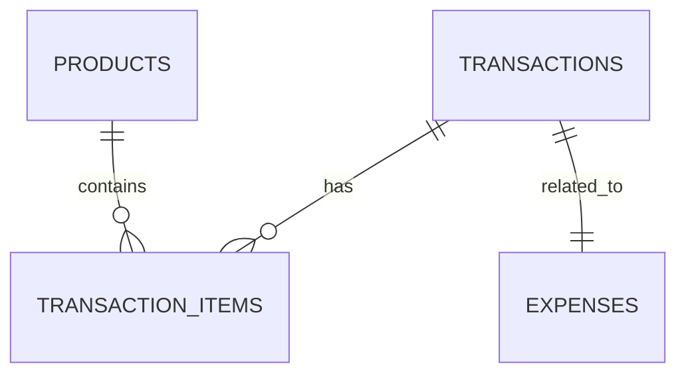
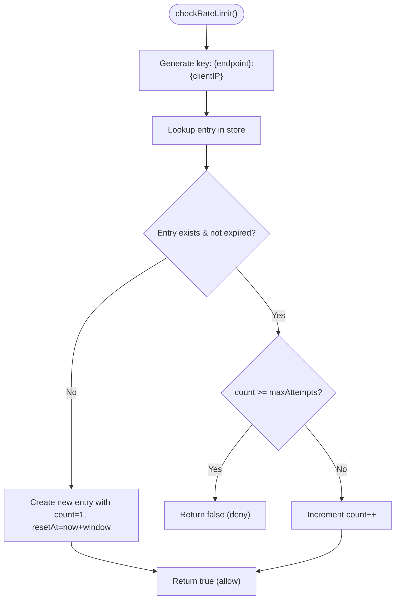
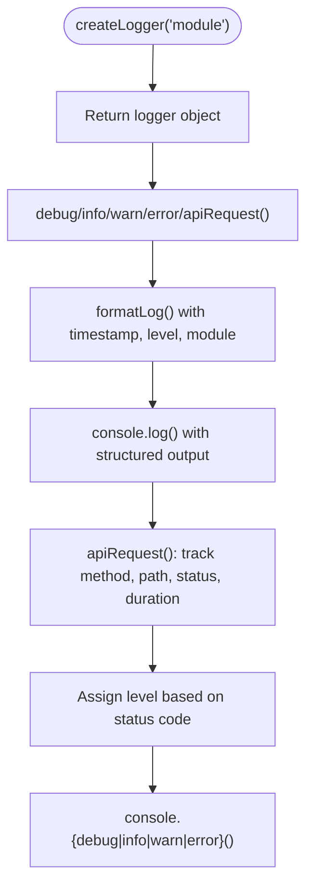
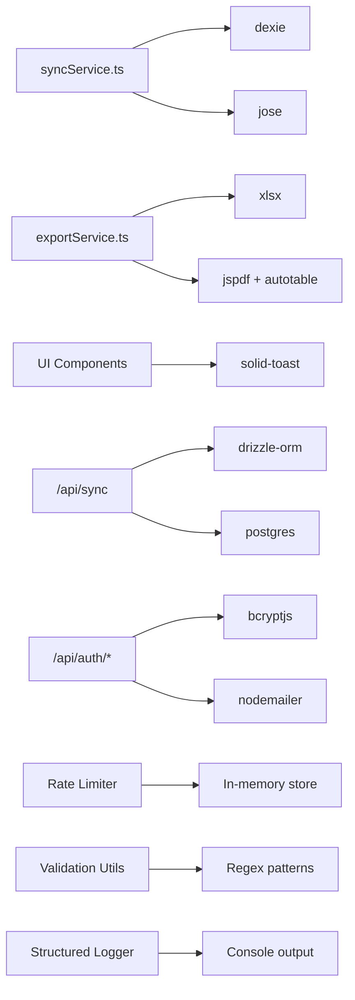

# Utility Libraries

<cite>
**Referenced Files in This Document**
- [syncService.ts](file://src/lib/syncService.ts)
- [exportService.ts](file://src/lib/exportService.ts)
- [availability.ts](file://src/lib/availability.ts)
- [utils.ts](file://src/lib/utils.ts)
- [db.ts](file://src/db/db.ts)
- [index.ts](file://src/routes/api/sync/index.ts)
- [rateLimit.ts](file://src/server/utils/rateLimit.ts)
- [validation.ts](file://src/server/utils/validation.ts)
- [logger.ts](file://src/server/utils/logger.ts)
- [auth.ts](file://src/server/utils/auth.ts)
- [login.ts](file://src/routes/api/auth/login.ts)
- [package.json](file://package.json)
</cite>

## Update Summary
**Changes Made**
- Added new server-side utility libraries for enhanced API reliability and security
- Integrated rate limiting system for API protection against abuse
- Implemented structured validation utilities for consistent data validation
- Added comprehensive logging system with structured log formatting
- Enhanced authentication and authorization utilities with improved error handling

## Table of Contents
1. [Introduction](#introduction)
2. [Project Structure](#project-structure)
3. [Core Components](#core-components)
4. [Architecture Overview](#architecture-overview)
5. [Detailed Component Analysis](#detailed-component-analysis)
6. [New Server-Side Utility Libraries](#new-server-side-utility-libraries)
7. [Dependency Analysis](#dependency-analysis)
8. [Performance Considerations](#performance-considerations)
9. [Security Enhancements](#security-enhancements)
10. [Troubleshooting Guide](#troubleshooting-guide)
11. [Conclusion](#conclusion)
12. [Appendices](#appendices)

## Introduction
This document describes the utility libraries that power offline-first operations, reporting, and common business logic in the NgePos POS system. The system now includes enhanced server-side utilities for improved API reliability, security, and operational visibility. It focuses on:
- Synchronization service for offline data management, sync queue processing, conflict resolution, and retry logic
- Export service for report generation, PDF creation, CSV export, and data formatting
- Utility functions for availability calculations, mathematical operations, and common business logic
- **NEW**: Rate limiting system for API protection against abuse and DDoS attacks
- **NEW**: Structured validation utilities for consistent data validation across endpoints
- **NEW**: Comprehensive logging system with structured log formatting and API request tracking
- Error handling utilities, validation functions, and performance optimization tools
- Practical usage examples, integration patterns, customization options, testing strategies, debugging utilities, and extension points

## Project Structure
The utility libraries reside under src/lib (client-side) and src/server/utils (server-side). The client-side includes the existing Dexie database integration and server-side utilities provide enhanced security and reliability. The server-side utilities are integrated into API endpoints for comprehensive protection and monitoring.

**Diagram sources**
- [syncService.ts:1-59](file://src/lib/syncService.ts#L1-L59)
- [exportService.ts:1-293](file://src/lib/exportService.ts#L1-L293)
- [availability.ts:1-40](file://src/lib/availability.ts#L1-L40)
- [utils.ts:1-7](file://src/lib/utils.ts#L1-L7)
- [db.ts:270-498](file://src/db/db.ts#L270-L498)
- [index.ts:1-155](file://src/routes/api/sync/index.ts#L1-L155)
- [rateLimit.ts:1-52](file://src/server/utils/rateLimit.ts#L1-L52)
- [validation.ts:1-89](file://src/server/utils/validation.ts#L1-L89)
- [logger.ts:1-69](file://src/server/utils/logger.ts#L1-L69)
- [auth.ts:1-52](file://src/server/utils/auth.ts#L1-L52)
- [login.ts:1-80](file://src/routes/api/auth/login.ts#L1-L80)

**Section sources**
- [syncService.ts:1-59](file://src/lib/syncService.ts#L1-L59)
- [exportService.ts:1-293](file://src/lib/exportService.ts#L1-L293)
- [availability.ts:1-40](file://src/lib/availability.ts#L1-L40)
- [utils.ts:1-7](file://src/lib/utils.ts#L1-L7)
- [db.ts:270-498](file://src/db/db.ts#L270-L498)
- [index.ts:1-155](file://src/routes/api/sync/index.ts#L1-L155)
- [rateLimit.ts:1-52](file://src/server/utils/rateLimit.ts#L1-L52)
- [validation.ts:1-89](file://src/server/utils/validation.ts#L1-L89)
- [logger.ts:1-69](file://src/server/utils/logger.ts#L1-L69)
- [auth.ts:1-52](file://src/server/utils/auth.ts#L1-L52)
- [login.ts:1-80](file://src/routes/api/auth/login.ts#L1-L80)
- [package.json:11-40](file://package.json#L11-L40)

## Core Components
- Sync Service: Orchestrates offline-to-online synchronization with debounced triggering, local data fetching, API posting, and local state updates.
- Export Service: Generates Excel (.xlsx) and PDF reports with dynamic imports, formatting helpers, and structured layouts.
- Availability Calculator: Computes product availability based on product toggles and ingredient stock conditions.
- Utilities: Tailwind CSS merging helper for class composition.
- Database Schema: Defines typed models and Dexie schema for local storage of transactions, items, expenses, and related entities.
- **NEW**: Rate Limiter: In-memory sliding window rate limiting for API endpoints with automatic cleanup.
- **NEW**: Validation Utilities: Centralized validation functions for common data validation patterns.
- **NEW**: Structured Logger: Consistent log formatting with context, levels, and timestamps for operational monitoring.

**Section sources**
- [syncService.ts:4-58](file://src/lib/syncService.ts#L4-L58)
- [exportService.ts:45-293](file://src/lib/exportService.ts#L45-L293)
- [availability.ts:12-39](file://src/lib/availability.ts#L12-L39)
- [utils.ts:4-6](file://src/lib/utils.ts#L4-L6)
- [db.ts:82-137](file://src/db/db.ts#L82-L137)
- [rateLimit.ts:1-52](file://src/server/utils/rateLimit.ts#L1-L52)
- [validation.ts:1-89](file://src/server/utils/validation.ts#L1-L89)
- [logger.ts:1-69](file://src/server/utils/logger.ts#L1-L69)

## Architecture Overview
The system follows an offline-first pattern with enhanced security and reliability:
- Client captures transactions and expenses locally in Dexie.
- Sync Service periodically pushes pending data to the server via a dedicated endpoint.
- Server applies rate limiting, validates JWT, performs structured validation, and logs activities.
- Server upserts records and acknowledges completion with comprehensive logging.
- Local state is updated to reflect synced status.

**Diagram sources**
- [syncService.ts:5-58](file://src/lib/syncService.ts#L5-L58)
- [db.ts:270-498](file://src/db/db.ts#L270-L498)
- [index.ts:10-155](file://src/routes/api/sync/index.ts#L10-L155)
- [rateLimit.ts:22-34](file://src/server/utils/rateLimit.ts#L22-L34)
- [validation.ts:38-49](file://src/server/utils/validation.ts#L38-L49)
- [logger.ts:50-67](file://src/server/utils/logger.ts#L50-L67)

## Detailed Component Analysis

### Synchronization Service
Responsibilities:
- Fetches pending transactions and all expenses from Dexie
- Loads associated transaction items
- Posts data to the server endpoint with Authorization header
- On success, marks transactions as synced locally
- Debounced trigger to prevent excessive network calls

Processing logic highlights:
- Parallel fetch of pending transactions and expenses
- Computation of transaction-item relationships
- Conditional marking of synced status
- Minimal error handling with console logging

**Diagram sources**
- [syncService.ts:5-48](file://src/lib/syncService.ts#L5-L48)
- [db.ts:82-98](file://src/db/db.ts#L82-L98)
- [index.ts:20-155](file://src/routes/api/sync/index.ts#L20-L155)

**Section sources**
- [syncService.ts:4-58](file://src/lib/syncService.ts#L4-L58)
- [index.ts:10-155](file://src/routes/api/sync/index.ts#L10-L155)

### Export Service
Capabilities:
- Excel export with four sheets: Summary, Transactions, Product Details, Expenses
- PDF export with premium styling, tables, and footer pagination
- Dynamic imports for xlsx and jspdf to keep bundle size small
- Formatting helpers for currency (IDR) and localized date/time

Key features:
- Currency formatter for Indonesian Rupiah
- Date formatter for Indonesian locale
- Structured report summary metrics
- Outlet branding support (logo, name, address, phone)
- Auto-table integration for PDF tables

**Diagram sources**
- [exportService.ts:49-132](file://src/lib/exportService.ts#L49-L132)
- [exportService.ts:137-291](file://src/lib/exportService.ts#L137-L291)

**Section sources**
- [exportService.ts:45-293](file://src/lib/exportService.ts#L45-L293)

### Availability Calculator
Logic:
- Product availability depends on product isActive flag
- If product has ingredients, all ingredients must be active and have stock > 0
- Returns availability status and optional reason for failure

**Diagram sources**
- [availability.ts:12-39](file://src/lib/availability.ts#L12-L39)

**Section sources**
- [availability.ts:12-39](file://src/lib/availability.ts#L12-L39)

### Utilities
- cn: Merges Tailwind CSS classes safely using clsx and tailwind-merge

**Section sources**
- [utils.ts:4-6](file://src/lib/utils.ts#L4-L6)

### Database Schema
- Typed models for Product, Category, Transaction, TransactionItem, Expense, and others
- Dexie database class with versioned migrations and table definitions
- Helper functions for settings and seeding

**Diagram sources**
- [db.ts:82-137](file://src/db/db.ts#L82-L137)
- [db.ts:270-498](file://src/db/db.ts#L270-L498)

**Section sources**
- [db.ts:82-137](file://src/db/db.ts#L82-L137)
- [db.ts:270-498](file://src/db/db.ts#L270-L498)

## New Server-Side Utility Libraries

### Rate Limiting System
The rate limiting system provides in-memory sliding window protection against API abuse and DDoS attacks:

**Core Features:**
- Sliding window algorithm with automatic cleanup every 5 minutes
- Configurable maximum attempts per time window
- Client IP extraction from proxy headers
- Standardized rate limit error responses
- Memory leak prevention through periodic cleanup

**Implementation Details:**
- Uses a Map to track request counts per key with reset timestamps
- Key format: `{endpoint}:{clientIP}` for granular control
- Window-based counting prevents abuse while allowing legitimate usage
- Cleanup interval prevents unbounded memory growth

**Diagram sources**
- [rateLimit.ts:22-34](file://src/server/utils/rateLimit.ts#L22-L34)
- [rateLimit.ts:8-13](file://src/server/utils/rateLimit.ts#L8-L13)

**Section sources**
- [rateLimit.ts:1-52](file://src/server/utils/rateLimit.ts#L1-L52)

### Validation Utilities
Centralized validation functions ensure consistent data validation across all API endpoints:

**Validation Functions:**
- Email format validation using standard regex pattern
- String validation with configurable min/max length bounds
- Positive number validation with finite checks
- Non-empty array validation
- Password strength validation (6-128 characters)
- Safe JSON parsing with comprehensive error handling
- Structured validation for sync transactions, items, and expenses

**Integration Benefits:**
- Consistent validation patterns across endpoints
- Reduced code duplication in API handlers
- Comprehensive error responses with specific validation failures
- Structured validation for complex data structures

**Section sources**
- [validation.ts:1-89](file://src/server/utils/validation.ts#L1-L89)

### Structured Logging System
Provides consistent log formatting with context, levels, and timestamps for operational monitoring:

**Logging Features:**
- Structured log entries with timestamp, level, module, and message
- Support for additional details in log entries
- Multiple log levels: debug, info, warn, error
- API request logging with method, path, status, and duration
- Environment-based log level filtering (debug mode support)
- ISO timestamp formatting for consistency

**API Request Tracking:**
- Automatic status-based log level assignment
- Duration tracking for performance monitoring
- Contextual details for troubleshooting
- Consistent formatting across all endpoints

**Diagram sources**
- [logger.ts:29-67](file://src/server/utils/logger.ts#L29-L67)
- [logger.ts:16-22](file://src/server/utils/logger.ts#L16-L22)

**Section sources**
- [logger.ts:1-69](file://src/server/utils/logger.ts#L1-L69)

## Dependency Analysis
External dependencies leveraged by the utility libraries:
- dexie: IndexedDB wrapper for offline persistence
- xlsx: Excel export
- jspdf + jspdf-autotable: PDF generation and tables
- solid-toast: Toast notifications for user feedback
- jose: JWT verification for sync endpoint
- drizzle-orm + postgres: ORM and database driver on server
- **NEW**: bcryptjs: Password hashing for authentication
- **NEW**: nodemailer: Email services for verification

**Diagram sources**
- [syncService.ts:1-2](file://src/lib/syncService.ts#L1-L2)
- [exportService.ts:1-1](file://src/lib/exportService.ts#L1-L1)
- [package.json:22-39](file://package.json#L22-L39)
- [login.ts:5-8](file://src/routes/api/auth/login.ts#L5-L8)

**Section sources**
- [package.json:11-40](file://package.json#L11-L40)

## Performance Considerations
- Debounced sync: The sync service debounces requests to reduce server load and network overhead.
- Parallel data fetching: Pending transactions and expenses are fetched concurrently to minimize latency.
- Dynamic imports: Excel and PDF libraries are imported lazily to keep the initial bundle small.
- Local updates: After successful sync, only minimal local writes are performed to mark records as synced.
- **NEW**: Rate limiting: Prevents resource exhaustion and ensures fair usage of API endpoints.
- **NEW**: Structured logging: Provides efficient logging with minimal overhead and consistent formatting.
- **NEW**: Validation caching: Reusable validation functions reduce redundant checks across endpoints.

Recommendations:
- Introduce exponential backoff for retries if sync failures occur frequently.
- Batch large datasets to avoid memory pressure during exports.
- Consider incremental sync by last-sync timestamp to limit payload size.
- **NEW**: Monitor rate limit violations to identify potential abuse patterns.
- **NEW**: Use structured logs for performance monitoring and debugging.
- **NEW**: Implement centralized validation rules for complex business logic.

**Section sources**
- [syncService.ts:50-58](file://src/lib/syncService.ts#L50-L58)
- [exportService.ts:55](file://src/lib/exportService.ts#L55)
- [exportService.ts:144-149](file://src/lib/exportService.ts#L144-L149)
- [rateLimit.ts:8-13](file://src/server/utils/rateLimit.ts#L8-L13)
- [logger.ts:32-34](file://src/server/utils/logger.ts#L32-L34)

## Security Enhancements
The new utility libraries significantly improve API security and reliability:

**Authentication & Authorization:**
- JWT-based authentication with secure token signing
- Role-based permission checking with admin bypass
- Comprehensive error handling with specific error codes
- Secure password comparison using bcryptjs

**API Protection:**
- Rate limiting prevents brute force attacks and DDoS attempts
- Structured validation prevents injection attacks and malformed data
- Centralized validation reduces security vulnerabilities
- Detailed logging enables security monitoring and auditing

**Data Integrity:**
- Structured validation ensures data consistency
- Transactional database operations prevent partial updates
- Comprehensive error handling prevents data corruption
- Secure password handling protects user credentials

**Monitoring & Auditing:**
- Structured logs provide detailed audit trails
- API request logging tracks all operations with timing
- Error logging captures security incidents
- Performance metrics help identify suspicious patterns

**Section sources**
- [auth.ts:12-51](file://src/server/utils/auth.ts#L12-L51)
- [rateLimit.ts:22-51](file://src/server/utils/rateLimit.ts#L22-L51)
- [validation.ts:38-89](file://src/server/utils/validation.ts#L38-L89)
- [logger.ts:50-67](file://src/server/utils/logger.ts#L50-L67)

## Troubleshooting Guide
Common issues and remedies:
- Unauthorized sync: Ensure Authorization header with a valid Bearer token is present. The server verifies JWT using a secret.
- No pending data: The sync service exits early if there are no pending transactions and no expenses to sync.
- Network errors: Inspect console logs for sync errors; the service logs caught exceptions.
- PDF export failures: Dynamic import errors for jspdf or autotable can cause failures; verify dependencies.
- Excel export failures: Dynamic import errors for xlsx can cause failures; verify dependencies.
- **NEW**: Rate limit exceeded: API requests are blocked when exceeding configured limits; check rate limit configuration.
- **NEW**: Validation errors: Structured validation prevents malformed data; review validation error messages for specific field issues.
- **NEW**: Authentication failures: JWT verification errors indicate invalid tokens or insufficient permissions.

Debugging tips:
- Add toast notifications around sync initiation and completion for user feedback.
- Log transaction IDs and timestamps for failed sync attempts.
- Validate date formatting and currency formatting helpers in export functions.
- **NEW**: Monitor rate limit logs to identify abuse patterns or legitimate usage spikes.
- **NEW**: Use structured logs to trace API requests from client to database operations.
- **NEW**: Enable debug logging to capture detailed validation and authentication flows.

**Section sources**
- [index.ts:12-18](file://src/routes/api/sync/index.ts#L12-L18)
- [syncService.ts:45-47](file://src/lib/syncService.ts#L45-L47)
- [exportService.ts:156-160](file://src/lib/exportService.ts#L156-L160)
- [exportService.ts:55](file://src/lib/exportService.ts#L55)
- [exportService.ts:144-149](file://src/lib/exportService.ts#L144-L149)
- [login.ts:17-20](file://src/routes/api/auth/login.ts#L17-L20)
- [index.ts:15-18](file://src/routes/api/sync/index.ts#L15-L18)

## Conclusion
The utility libraries provide a robust foundation for offline-first POS operations, reliable reporting, and efficient business logic. The addition of server-side utilities significantly enhances API reliability, security, and operational visibility. The rate limiting system protects against abuse and ensures fair usage, while structured validation utilities guarantee data integrity across all endpoints. The comprehensive logging system enables detailed monitoring and auditing capabilities.

The sync service ensures resilient data propagation with minimal overhead, while the export service delivers professional financial reports. The availability calculator encapsulates product availability rules, and the utilities offer practical helpers for UI and data formatting. Together, they enable extensible, maintainable integrations and straightforward customization with enhanced security and reliability.

## Appendices

### Practical Usage Examples and Integration Patterns
- Triggering sync after checkout:
  - Call the debounced trigger after adding a transaction or expense to Dexie.
  - The service will collect pending data and post to the server.
  - Reference: [syncService.ts:52-58](file://src/lib/syncService.ts#L52-L58)

- Generating reports:
  - Build a report summary and pass transactions, items, and expenses to the export service.
  - For PDF, also provide outlet branding information.
  - References: [exportService.ts:49-132](file://src/lib/exportService.ts#L49-L132), [exportService.ts:137-291](file://src/lib/exportService.ts#L137-L291)

- Checking product availability:
  - Pass a product and the raw material library to compute availability and reasons.
  - Reference: [availability.ts:12-39](file://src/lib/availability.ts#L12-L39)

- Merging Tailwind classes:
  - Use the utility to merge class names safely.
  - Reference: [utils.ts:4-6](file://src/lib/utils.ts#L4-L6)

- **NEW**: Implementing rate limiting:
  - Use `checkRateLimit()` to protect API endpoints with sliding window limits.
  - Extract client IP with `getClientIp()` for accurate rate limiting.
  - Reference: [rateLimit.ts:22-43](file://src/server/utils/rateLimit.ts#L22-L43)

- **NEW**: Using validation utilities:
  - Apply centralized validation functions for consistent data validation.
  - Use `safeParseJson()` for secure JSON parsing with error handling.
  - Reference: [validation.ts:38-49](file://src/server/utils/validation.ts#L38-L49)

- **NEW**: Implementing structured logging:
  - Create scoped loggers with `createLogger()` for different modules.
  - Use `log.apiRequest()` to track API operations with timing and status.
  - Reference: [logger.ts:29-67](file://src/server/utils/logger.ts#L29-L67)

### Customization Options
- Sync behavior:
  - Adjust debounce interval to balance responsiveness and server load.
  - Extend conflict resolution by modifying upsert logic on the server.
  - Reference: [syncService.ts:52-58](file://src/lib/syncService.ts#L52-L58), [index.ts:44-155](file://src/routes/api/sync/index.ts#L44-L155)

- Export formatting:
  - Customize currency and date formats by adjusting helpers.
  - Modify PDF styling by editing color and layout constants.
  - Reference: [exportService.ts:9-22](file://src/lib/exportService.ts#L9-L22), [exportService.ts:188-205](file://src/lib/exportService.ts#L188-L205)

- Availability rules:
  - Extend availability checks to include stock thresholds or ingredient substitutions.
  - Reference: [availability.ts:12-39](file://src/lib/availability.ts#L12-L39)

- **NEW**: Rate limiting configuration:
  - Adjust `maxAttempts` and `windowMs` parameters for different endpoints.
  - Customize rate limit keys for endpoint-specific or IP-specific limits.
  - Reference: [rateLimit.ts:22-34](file://src/server/utils/rateLimit.ts#L22-L34)

- **NEW**: Validation customization:
  - Extend validation functions for specific business rules.
  - Add custom validation patterns for specialized data types.
  - Reference: [validation.ts:1-89](file://src/server/utils/validation.ts#L1-L89)

- **NEW**: Logging configuration:
  - Set `LOG_LEVEL` environment variable for debug mode.
  - Customize log formatting and output destinations.
  - Reference: [logger.ts:32-34](file://src/server/utils/logger.ts#L32-L34)

### Testing Strategies and Debugging Utilities
- Unit tests:
  - Mock Dexie queries and server responses to validate sync logic.
  - Test export functions with synthetic report data and verify generated files.
  - Validate availability calculations with various product and material states.
  - **NEW**: Test rate limiting logic with boundary conditions and cleanup behavior.
  - **NEW**: Validate validation utilities with edge cases and error scenarios.
  - **NEW**: Test structured logging output with different log levels and contexts.

- Integration tests:
  - Simulate offline scenarios and verify local persistence.
  - Validate JWT verification and error responses from the sync endpoint.
  - **NEW**: Test rate limit enforcement with concurrent requests.
  - **NEW**: Validate structured logging integration with API endpoints.
  - **NEW**: Test validation middleware with various request payloads.

- Debugging:
  - Use console logs and toast messages to track sync lifecycle.
  - Inspect transaction IDs and timestamps to correlate client and server states.
  - **NEW**: Monitor rate limit counters and cleanup intervals.
  - **NEW**: Use structured logs to trace request flows and identify bottlenecks.
  - **NEW**: Enable debug logging to capture detailed validation and authentication traces.
  - References: [syncService.ts:45-47](file://src/lib/syncService.ts#L45-L47), [index.ts:94-155](file://src/routes/api/sync/index.ts#L94-L155), [login.ts:17-20](file://src/routes/api/auth/login.ts#L17-L20)

### Extension Points
- Sync service:
  - Add retry logic with exponential backoff.
  - Implement per-record sync queues with priorities.
  - Reference: [syncService.ts:5-48](file://src/lib/syncService.ts#L5-L48)

- Export service:
  - Add CSV export alongside Excel/PDF.
  - Support multi-page PDFs and custom headers/footers.
  - Reference: [exportService.ts:49-132](file://src/lib/exportService.ts#L49-L132), [exportService.ts:137-291](file://src/lib/exportService.ts#L137-L291)

- Availability calculator:
  - Incorporate supplier lead times or batch expiration dates.
  - Reference: [availability.ts:12-39](file://src/lib/availability.ts#L12-L39)

- **NEW**: Rate limiting extensions:
  - Implement persistent storage for rate limits beyond process lifetime.
  - Add configuration management for different rate limit policies.
  - Integrate with external rate limiting services for distributed systems.
  - Reference: [rateLimit.ts:1-52](file://src/server/utils/rateLimit.ts#L1-L52)

- **NEW**: Validation system enhancements:
  - Add custom validation decorators for complex business rules.
  - Implement asynchronous validation for external data checks.
  - Create validation pipelines for multi-step validation processes.
  - Reference: [validation.ts:1-89](file://src/server/utils/validation.ts#L1-L89)

- **NEW**: Logging system improvements:
  - Add structured logging to external monitoring systems.
  - Implement log rotation and archival for production environments.
  - Create log aggregation and alerting based on structured log patterns.
  - Reference: [logger.ts:1-69](file://src/server/utils/logger.ts#L1-L69)