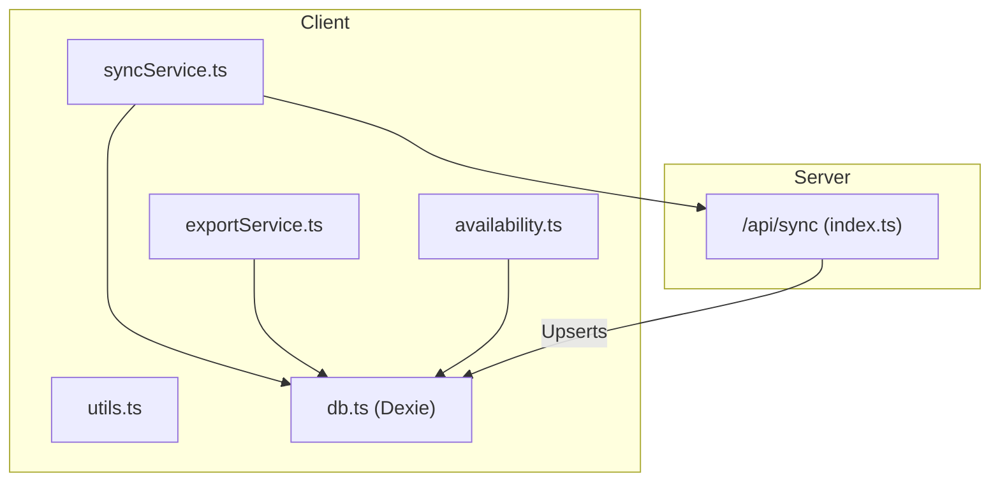
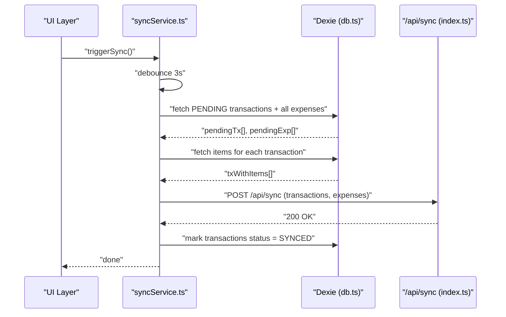
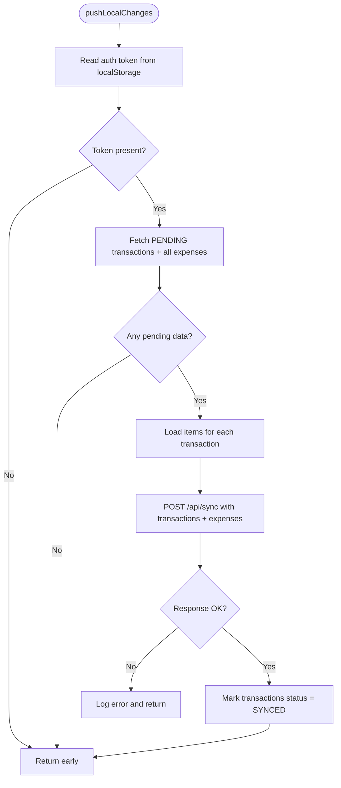
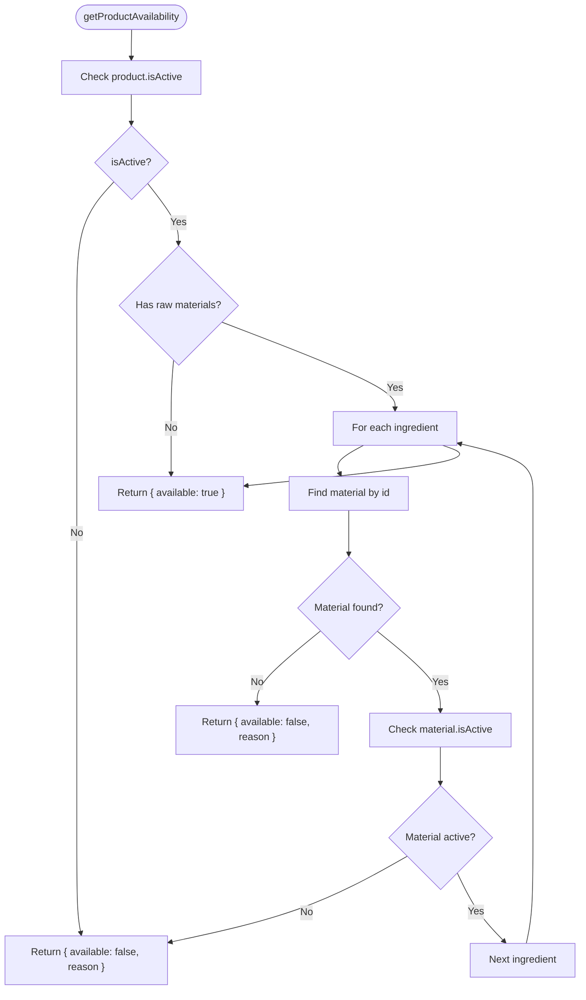
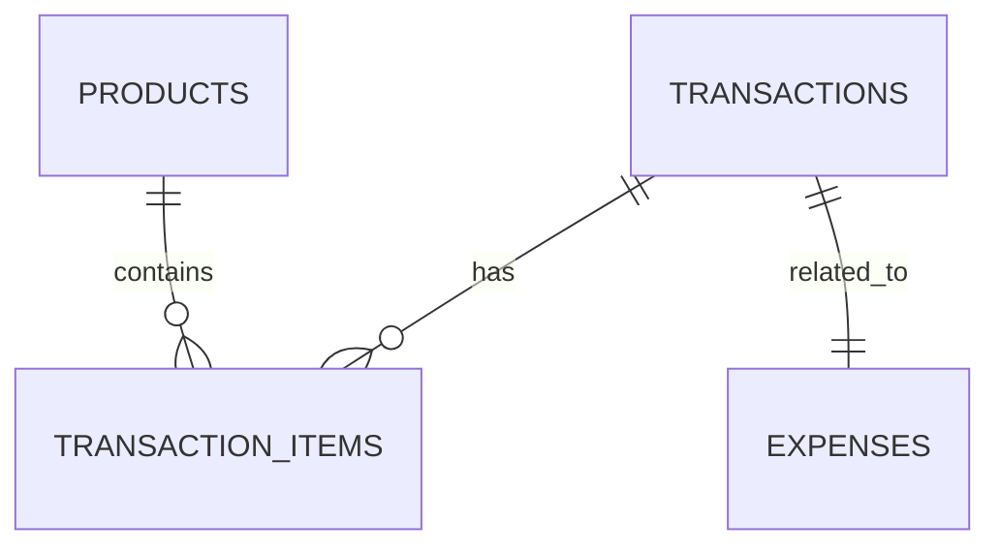
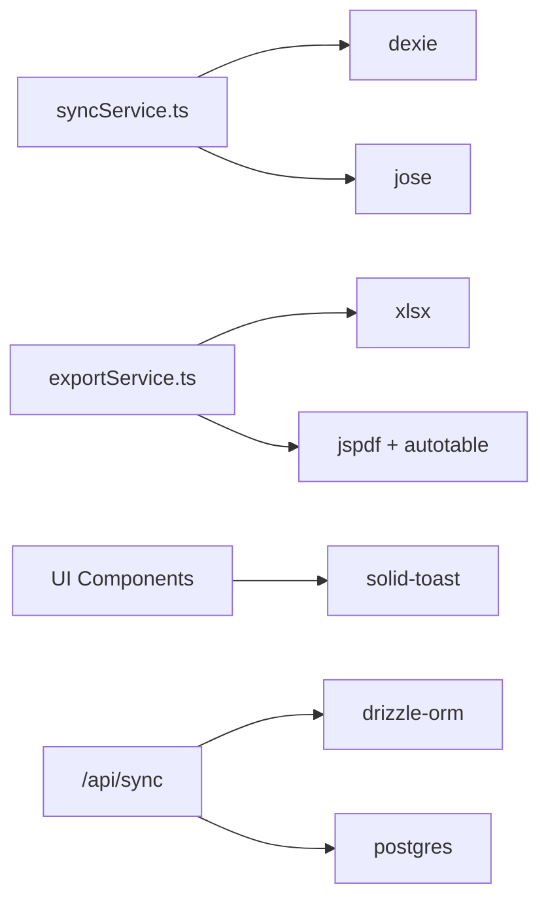

# Utility Libraries

<cite>
**Referenced Files in This Document**
- [syncService.ts](file://src/lib/syncService.ts)
- [exportService.ts](file://src/lib/exportService.ts)
- [availability.ts](file://src/lib/availability.ts)
- [utils.ts](file://src/lib/utils.ts)
- [db.ts](file://src/db/db.ts)
- [index.ts](file://src/routes/api/sync/index.ts)
- [package.json](file://package.json)
</cite>

## Table of Contents
1. [Introduction](#introduction)
2. [Project Structure](#project-structure)
3. [Core Components](#core-components)
4. [Architecture Overview](#architecture-overview)
5. [Detailed Component Analysis](#detailed-component-analysis)
6. [Dependency Analysis](#dependency-analysis)
7. [Performance Considerations](#performance-considerations)
8. [Troubleshooting Guide](#troubleshooting-guide)
9. [Conclusion](#conclusion)
10. [Appendices](#appendices)

## Introduction
This document describes the utility libraries that power offline-first operations, reporting, and common business logic in the NgePos POS system. It focuses on:
- Synchronization service for offline data management, sync queue processing, conflict resolution, and retry logic
- Export service for report generation, PDF creation, CSV export, and data formatting
- Utility functions for availability calculations, mathematical operations, and common business logic
- Error handling utilities, validation functions, and performance optimization tools
- Practical usage examples, integration patterns, customization options, testing strategies, debugging utilities, and extension points

## Project Structure
The utility libraries reside under src/lib and integrate with the client-side Dexie database (src/db/db.ts) and the server-side sync endpoint (src/routes/api/sync/index.ts). Supporting dependencies are declared in package.json.

**Diagram sources**
- [syncService.ts:1-110](file://src/lib/syncService.ts#L1-L110)
- [exportService.ts:1-293](file://src/lib/exportService.ts#L1-L293)
- [availability.ts:1-40](file://src/lib/availability.ts#L1-L40)
- [utils.ts:1-7](file://src/lib/utils.ts#L1-L7)
- [db.ts:270-498](file://src/db/db.ts#L270-L498)
- [index.ts:1-98](file://src/routes/api/sync/index.ts#L1-L97)

**Section sources**
- [syncService.ts:1-110](file://src/lib/syncService.ts#L1-L110)
- [exportService.ts:1-293](file://src/lib/exportService.ts#L1-L293)
- [availability.ts:1-40](file://src/lib/availability.ts#L1-L40)
- [utils.ts:1-7](file://src/lib/utils.ts#L1-L7)
- [db.ts:270-498](file://src/db/db.ts#L270-L498)
- [index.ts:1-98](file://src/routes/api/sync/index.ts#L1-L97)
- [package.json:11-40](file://package.json#L11-L40)

## Core Components
- Sync Service: Orchestrates offline-to-online synchronization with debounced triggering, local data fetching, API posting, and local state updates.
- Export Service: Generates Excel (.xlsx) and PDF reports with dynamic imports, formatting helpers, and structured layouts.
- Availability Calculator: Computes product availability based on product toggles and ingredient stock conditions.
- Utilities: Tailwind CSS merging helper for class composition.
- Database Schema: Defines typed models and Dexie schema for local storage of transactions, items, expenses, and related entities.

**Section sources**
- [syncService.ts:4-58](file://src/lib/syncService.ts#L4-L58)
- [exportService.ts:45-293](file://src/lib/exportService.ts#L45-L293)
- [availability.ts:12-39](file://src/lib/availability.ts#L12-L39)
- [utils.ts:4-6](file://src/lib/utils.ts#L4-L6)
- [db.ts:82-137](file://src/db/db.ts#L82-L137)

## Architecture Overview
The system follows an offline-first pattern:
- Client captures transactions and expenses locally in Dexie.
- Sync Service periodically pushes pending data to the server via a dedicated endpoint.
- Server validates JWT, upserts records, and acknowledges completion.
- Local state is updated to reflect synced status.

**Diagram sources**
- [syncService.ts:5-58](file://src/lib/syncService.ts#L5-L58)
- [db.ts:270-498](file://src/db/db.ts#L270-L498)
- [index.ts:10-97](file://src/routes/api/sync/index.ts#L10-L97)

## Detailed Component Analysis

### Synchronization Service
Responsibilities:
- Fetches pending transactions and all expenses from Dexie
- Loads associated transaction items
- Posts data to the server endpoint with Authorization header
- On success, marks transactions as synced locally
- Debounced trigger to prevent excessive network calls

Processing logic highlights:
- Parallel fetch of pending transactions and expenses
- Computation of transaction-item relationships
- Conditional marking of synced status
- Minimal error handling with console logging

**Diagram sources**
- [syncService.ts:5-48](file://src/lib/syncService.ts#L5-L48)
- [db.ts:82-98](file://src/db/db.ts#L82-L98)
- [index.ts:20-92](file://src/routes/api/sync/index.ts#L20-L92)

**Section sources**
- [syncService.ts:4-58](file://src/lib/syncService.ts#L4-L58)
- [index.ts:10-97](file://src/routes/api/sync/index.ts#L10-L97)

### Export Service
Capabilities:
- Excel export with four sheets: Summary, Transactions, Product Details, Expenses
- PDF export with premium styling, tables, and footer pagination
- Dynamic imports for xlsx and jspdf to keep bundle size small
- Formatting helpers for currency (IDR) and localized date/time

Key features:
- Currency formatter for Indonesian Rupiah
- Date formatter for Indonesian locale
- Structured report summary metrics
- Outlet branding support (logo, name, address, phone)
- Auto-table integration for PDF tables

**Diagram sources**
- [exportService.ts:49-132](file://src/lib/exportService.ts#L49-L132)
- [exportService.ts:137-291](file://src/lib/exportService.ts#L137-L291)

**Section sources**
- [exportService.ts:45-293](file://src/lib/exportService.ts#L45-L293)

### Availability Calculator
Logic:
- Product availability depends on product isActive flag
- If product has ingredients, all ingredients must be active and have stock > 0
- Returns availability status and optional reason for failure

**Diagram sources**
- [availability.ts:12-39](file://src/lib/availability.ts#L12-L39)

**Section sources**
- [availability.ts:12-39](file://src/lib/availability.ts#L12-L39)

### Utilities
- cn: Merges Tailwind CSS classes safely using clsx and tailwind-merge

**Section sources**
- [utils.ts:4-6](file://src/lib/utils.ts#L4-L6)

### Database Schema
- Typed models for Product, Category, Transaction, TransactionItem, Expense, and others
- Dexie database class with versioned migrations and table definitions
- Helper functions for settings and seeding

**Diagram sources**
- [db.ts:82-137](file://src/db/db.ts#L82-L137)
- [db.ts:270-498](file://src/db/db.ts#L270-L498)

**Section sources**
- [db.ts:82-137](file://src/db/db.ts#L82-L137)
- [db.ts:270-498](file://src/db/db.ts#L270-L498)

## Dependency Analysis
External dependencies leveraged by the utility libraries:
- dexie: IndexedDB wrapper for offline persistence
- xlsx: Excel export
- jspdf + jspdf-autotable: PDF generation and tables
- solid-toast: Toast notifications for user feedback
- jose: JWT verification for sync endpoint
- drizzle-orm + postgres: ORM and database driver on server

**Diagram sources**
- [syncService.ts:1-2](file://src/lib/syncService.ts#L1-L2)
- [exportService.ts:1-1](file://src/lib/exportService.ts#L1-L1)
- [package.json:22-39](file://package.json#L22-L39)

**Section sources**
- [package.json:11-40](file://package.json#L11-L40)

## Performance Considerations
- Debounced sync: The sync service debounces requests to reduce server load and network overhead.
- Parallel data fetching: Pending transactions and expenses are fetched concurrently to minimize latency.
- Dynamic imports: Excel and PDF libraries are imported lazily to keep the initial bundle small.
- Local updates: After successful sync, only minimal local writes are performed to mark records as synced.

Recommendations:
- Introduce exponential backoff for retries if sync failures occur frequently.
- Batch large datasets to avoid memory pressure during exports.
- Consider incremental sync by last-sync timestamp to limit payload size.

**Section sources**
- [syncService.ts:50-58](file://src/lib/syncService.ts#L50-L58)
- [exportService.ts:55](file://src/lib/exportService.ts#L55)
- [exportService.ts:144-149](file://src/lib/exportService.ts#L144-L149)

## Troubleshooting Guide
Common issues and remedies:
- Unauthorized sync: Ensure Authorization header with a valid Bearer token is present. The server verifies JWT using a secret.
- No pending data: The sync service exits early if there are no pending transactions and no expenses to sync.
- Network errors: Inspect console logs for sync errors; the service logs caught exceptions.
- PDF export failures: Dynamic import errors for jspdf or autotable can cause failures; verify dependencies.
- Excel export failures: Dynamic import errors for xlsx can cause failures; verify dependencies.

Debugging tips:
- Add toast notifications around sync initiation and completion for user feedback.
- Log transaction IDs and timestamps for failed sync attempts.
- Validate date formatting and currency formatting helpers in export functions.

**Section sources**
- [index.ts:12-18](file://src/routes/api/sync/index.ts#L12-L18)
- [syncService.ts:45-47](file://src/lib/syncService.ts#L45-L47)
- [exportService.ts:156-160](file://src/lib/exportService.ts#L156-L160)
- [exportService.ts:55](file://src/lib/exportService.ts#L55)
- [exportService.ts:144-149](file://src/lib/exportService.ts#L144-L149)

## Conclusion
The utility libraries provide a robust foundation for offline-first POS operations, reliable reporting, and efficient business logic. The sync service ensures resilient data propagation with minimal overhead, while the export service delivers professional financial reports. The availability calculator encapsulates product availability rules, and the utilities offer practical helpers for UI and data formatting. Together, they enable extensible, maintainable integrations and straightforward customization.

## Appendices

### Practical Usage Examples and Integration Patterns
- Triggering sync after checkout:
  - Call the debounced trigger after adding a transaction or expense to Dexie.
  - The service will collect pending data and post to the server.
  - Reference: [syncService.ts:52-58](file://src/lib/syncService.ts#L52-L58)

- Generating reports:
  - Build a report summary and pass transactions, items, and expenses to the export service.
  - For PDF, also provide outlet branding information.
  - References: [exportService.ts:49-132](file://src/lib/exportService.ts#L49-L132), [exportService.ts:137-291](file://src/lib/exportService.ts#L137-L291)

- Checking product availability:
  - Pass a product and the raw material library to compute availability and reasons.
  - Reference: [availability.ts:12-39](file://src/lib/availability.ts#L12-L39)

- Merging Tailwind classes:
  - Use the utility to merge class names safely.
  - Reference: [utils.ts:4-6](file://src/lib/utils.ts#L4-L6)

### Customization Options
- Sync behavior:
  - Adjust debounce interval to balance responsiveness and server load.
  - Extend conflict resolution by modifying upsert logic on the server.
  - Reference: [syncService.ts:52-58](file://src/lib/syncService.ts#L52-L58), [index.ts:44-88](file://src/routes/api/sync/index.ts#L44-L88)

- Export formatting:
  - Customize currency and date formats by adjusting helpers.
  - Modify PDF styling by editing color and layout constants.
  - Reference: [exportService.ts:9-22](file://src/lib/exportService.ts#L9-L22), [exportService.ts:188-205](file://src/lib/exportService.ts#L188-L205)

- Availability rules:
  - Extend availability checks to include stock thresholds or ingredient substitutions.
  - Reference: [availability.ts:12-39](file://src/lib/availability.ts#L12-L39)

### Testing Strategies and Debugging Utilities
- Unit tests:
  - Mock Dexie queries and server responses to validate sync logic.
  - Test export functions with synthetic report data and verify generated files.
  - Validate availability calculations with various product and material states.
- Integration tests:
  - Simulate offline scenarios and verify local persistence.
  - Validate JWT verification and error responses from the sync endpoint.
- Debugging:
  - Use console logs and toast messages to track sync lifecycle.
  - Inspect transaction IDs and timestamps to correlate client and server states.
  - References: [syncService.ts:45-47](file://src/lib/syncService.ts#L45-L47), [index.ts:94-96](file://src/routes/api/sync/index.ts#L94-L96)

### Extension Points
- Sync service:
  - Add retry logic with exponential backoff.
  - Implement per-record sync queues with priorities.
  - Reference: [syncService.ts:5-48](file://src/lib/syncService.ts#L5-L48)

- Export service:
  - Add CSV export alongside Excel/PDF.
  - Support multi-page PDFs and custom headers/footers.
  - Reference: [exportService.ts:49-132](file://src/lib/exportService.ts#L49-L132), [exportService.ts:137-291](file://src/lib/exportService.ts#L137-L291)

- Availability calculator:
  - Incorporate supplier lead times or batch expiration dates.
  - Reference: [availability.ts:12-39](file://src/lib/availability.ts#L12-L39)