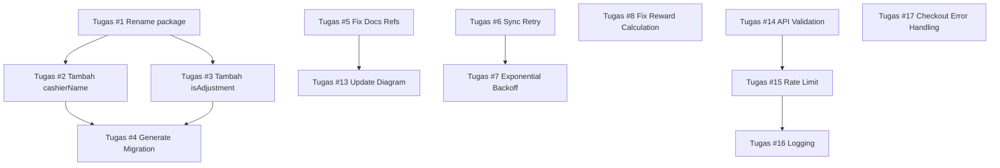

# 🗺️ ROADMAP PENGEMBANGAN NGEPOS

Dokumen ini berisi daftar tugas kerja terstruktur dan terprioritaskan berdasarkan hasil analisis proyek. Tugas disusun berdasarkan kompleksitas, dependensi antar fitur, dan urutan implementasi yang logis.

---

## 📋 PRINSIP PENYUSUNAN

1. **Prioritas Tinggi**: Perbaikan bug, konsistensi data, dan fitur inti
2. **Prioritas Sedang**: Fitur pendukung, optimasi, dan dokumentasi
3. **Prioritas Rendah**: Fitur tambahan, polish UI, dan enhancement
4. **Dependensi**: Tugas yang menjadi dasar untuk tugas lain dikerjakan terlebih dahulu

---

## 🔴 PRIORITAS TINGGI (SEGERA DILAKUKAN)

| No | Tugas | Lokasi File | Kompleksitas | Dependensi |
|----|-------|-------------|--------------|------------|
| 1 | **Rename package.json** dari `example-with-tailwindcss` menjadi `ngepos` | [`package.json:2`](package.json:2) | Sangat Rendah | Tidak ada |
| 2 | **Tambahkan kolom `cashierName`** ke tabel `transactions` di PostgreSQL schema | [`src/server/db/schema.ts:35`](src/server/db/schema.ts:35) | Rendah | Tidak ada |
| 3 | **Tambahkan kolom `isAdjustment`** ke tabel `transactions` di PostgreSQL schema | [`src/server/db/schema.ts:35`](src/server/db/schema.ts:35) | Rendah | Tidak ada |
| 4 | **Generate migration Drizzle** untuk perubahan schema di atas | `drizzle/` | Rendah | #2, #3 |
| 5 | **Perbaiki invalid line references** di seluruh dokumentasi `.qoder/repowiki/en/` | `.qoder/repowiki/en/` | Rendah | Tidak ada |
| 6 | **Tambahkan retry logic** untuk sync service jika gagal koneksi server | [`src/lib/syncService.ts:45`](src/lib/syncService.ts:45) | Sedang | Tidak ada |
| 7 | **Tambahkan exponential backoff** pada sync retry | [`src/lib/syncService.ts:50`](src/lib/syncService.ts:50) | Sedang | #6 |
| 8 | **Perbaiki perhitungan reward amount** di checkout untuk loyalty | [`src/hooks/useCheckout.ts:33`](src/hooks/useCheckout.ts:33) | Rendah | Tidak ada |

---

## 🟡 PRIORITAS SEDANG (SELANJUTNYA)

| No | Tugas | Lokasi File | Kompleksitas | Dependensi |
|----|-------|-------------|--------------|------------|
| 9 | **Dokumentasikan `VariantSelector` component** dengan contoh usage | [`src/components/VariantSelector.tsx`](src/components/VariantSelector.tsx) | Rendah | Tidak ada |
| 10 | **Dokumentasikan `availability.ts` logic** untuk pengecekan stok produk | [`src/lib/availability.ts`](src/lib/availability.ts) | Rendah | Tidak ada |
| 11 | **Tambahkan troubleshooting section** untuk sync failures dan auth issues | `.qoder/repowiki/en/content/Troubleshooting & FAQ.md` | Rendah | Tidak ada |
| 12 | **Dokumentasikan alur backdate transaction** | `.qoder/repowiki/en/content/Financial Management/` | Sedang | Tidak ada |
| 13 | **Update diagram refs** agar sesuai dengan actual line numbers | `.qoder/repowiki/en/` | Rendah | Tidak ada |
| 14 | **Tambahkan validasi input** di semua API endpoint | `src/routes/api/` | Sedang | Tidak ada |
| 15 | **Implementasikan rate limiting** untuk semua endpoint API | `src/server/utils/rateLimit.ts` | Sedang | Tidak ada |
| 16 | **Tambahkan logging terstruktur** di seluruh server API | `src/routes/api/` | Sedang | Tidak ada |
| 17 | **Perbaiki error handling** di `useCheckout` hook | [`src/hooks/useCheckout.ts:206`](src/hooks/useCheckout.ts:206) | Sedang | Tidak ada |
| 18 | **Tambahkan unit test** untuk cart store dan discount calculation | `tests/` | Sedang | Tidak ada |

---

## 🟢 PRIORITAS RENDAH (OPTIONAL)

| No | Tugas | Lokasi File | Kompleksitas | Dependensi |
|----|-------|-------------|--------------|------------|
| 19 | **Dokumentasikan receipt/struk generation flow** | [`src/routes/app/receipt/[id].tsx`](src/routes/app/receipt/[id].tsx) | Rendah | Tidak ada |
| 20 | **Tambahkan sequence diagram** untuk loyalty reward claim process | `.qoder/repowiki/en/content/Marketing & Loyalty/` | Rendah | Tidak ada |
| 21 | **Dokumentasikan role-based navigation enforcement** | [`src/components/BottomNav.tsx`](src/components/BottomNav.tsx) | Rendah | Tidak ada |
| 22 | **Implementasikan cache invalidation** untuk data yang di-sync | [`src/lib/syncService.ts`](src/lib/syncService.ts) | Sedang | Tidak ada |
| 23 | **Tambahkan progress indicator** saat sync sedang berjalan | [`src/components/TopNav.tsx`](src/components/TopNav.tsx) | Rendah | Tidak ada |
| 24 | **Optimasi bundle size** dengan code splitting | `vite.config.ts` | Sedang | Tidak ada |
| 25 | **Tambahkan PWA support** untuk offline mode yang lebih baik | `vite.config.ts` | Sedang | Tidak ada |
| 26 | **Implementasikan backup otomatis** untuk IndexedDB | [`src/db/db.ts`](src/db/db.ts) | Sedang | Tidak ada |
| 27 | **Tambahkan audit log** untuk semua perubahan data penting | `src/server/db/schema.ts` | Tinggi | Tidak ada |
| 28 | **Implementasikan multi-outlet support** | Seluruh proyek | Tinggi | Tidak ada |

---

## 📊 URUTAN PELAKSANAAN YANG DIREKOMENDASIKAN

### Fase 1: Perbaikan Dasar & Konsistensi
✅ **Estimasi: 1-2 hari**
1. Tugas #1, #2, #3, #4
2. Tugas #5, #13
3. Tugas #8

### Fase 2: Stabilitas & Reliabilitas
✅ **Estimasi: 2-3 hari**
4. Tugas #6, #7
5. Tugas #17
6. Tugas #14, #15, #16

### Fase 3: Dokumentasi & Testing
✅ **Estimasi: 2 hari**
7. Tugas #9, #10, #11, #12
8. Tugas #18

### Fase 4: Optimasi & Enhancement
✅ **Estimasi: 3-4 hari**
9. Tugas #22, #23
10. Tugas #24, #25
11. Tugas #26

### Fase 5: Fitur Lanjutan
✅ **Estimasi: 4-5 hari**
12. Tugas #27
13. Tugas #28

---

## 📝 CATATAN PENTING UNTUK CODER

1. **Jangan merubah arsitektur inti** tanpa review terlebih dahulu
2. **Selalu buat migration** untuk setiap perubahan schema database
3. **Jangan menghapus field** yang sudah ada, tambahkan saja field baru
4. **Pastikan backward compatibility** untuk semua perubahan
5. **Test offline mode** setiap kali merubah sync logic
6. **Jangan lupa update dokumentasi** setiap kali merubah fitur
7. **Gunakan atomic transaction** untuk semua operasi database
8. **Selalu handle error** dengan baik dan berikan feedback user yang jelas

---

## 🔗 DEPENDENSI ANTAR TUGAS

---

*Roadmap dibuat berdasarkan analisis proyek tanggal 16 April 2026*
*Total tugas: 28 item | Total estimasi: ~12-16 hari kerja*